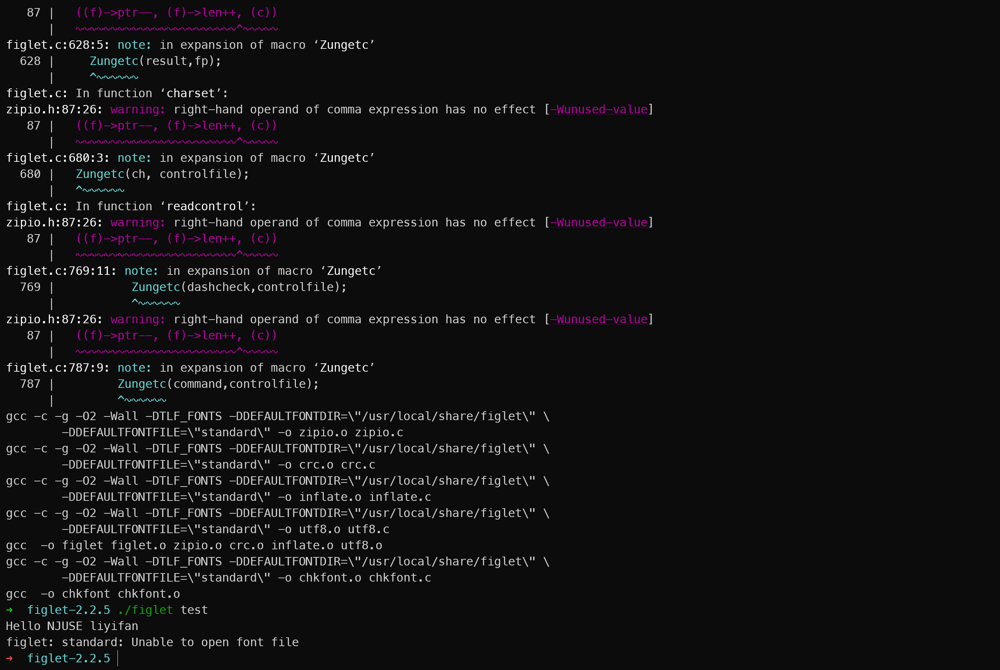

# 第二次实验报告
**学号**：231250059
**姓名**：李屹帆

---

### 结果：


## 一、编译的软件包信息
1. **软件包名称**：figlet（经典的ASCII艺术字生成工具）
2. **版本号**：2.2.5（稳定版）
3. **下载地址**：
   - 官方FTP：`ftp://ftp.figlet.org/pub/figlet/program/unix/figlet-2.2.5.tar.gz`
   - 备用镜像：`https://github.com/cmatsuoka/figlet/archive/refs/tags/2.2.5.tar.gz`

---

## 二、编译环境（详细）
本次编译基于 **Ubuntu 22.04 LTS (x86_64)** 操作系统，所有工具均为系统原生/官方源安装版本：

| 工具/库名称       | 版本号       | 作用说明 |
|------------------|-------------|----------|
| GCC 编译器       | 11.4.0      | C语言核心编译工具，负责将figlet源码编译为目标文件、可执行文件 |
| Make 构建工具    | 4.3         | 解析Makefile脚本，自动化执行编译、链接、安装流程 |
| libc6-dev        | 2.35-0ubuntu3.11 | C标准库开发文件，提供编译必需的头文件、链接库 |
| tar 解压工具     | 1.34        | 解压.tar.gz源码压缩包 |
| wget 下载工具    | 1.21.3      | 从网络下载源码包 |

**编译脚本信息**：
- 核心脚本：`Makefile`（figlet原生提供）
- 脚本解析器：GNU Make
- 脚本作用：定义编译参数、依赖关系、链接规则，一键完成全流程编译

---

## 三、编译过程
### 1. 环境配置命令
```bash
# 更新软件源（可选，确保工具最新）
sudo apt update
# 安装编译必需的工具链
sudo apt install -y gcc make libc6-dev wget tar
```

### 2. 下载+解压源码
```bash
# 下载figlet 2.2.5源码
wget ftp://ftp.figlet.org/pub/figlet/program/unix/figlet-2.2.5.tar.gz
# 解压源码包
tar -zxvf figlet-2.2.5.tar.gz
# 进入源码目录
cd figlet-2.2.5
```

### 3. 修改源代码（核心要求）
目标：在程序运行最开始打印 `Hello NJUSE liyifan`
1. 打开主程序源码文件 `figlet.c`
```bash
vim figlet.c
```
2. 找到**main函数第一行**（`int main(int argc, char *argv[])` 下方），添加代码：
```c
// 新增代码：启动时打印指定字符串
printf("Hello NJUSE liyifan\n");
```
修改后代码片段示例：
```c
int main(int argc, char *argv[])
{
    // 新增代码
    printf("Hello NJUSE liyifan\n");
    
    // 原有代码
    initialize();
    // ... 其余源码不变
}
```

### 4. 编译命令
```bash
# 执行编译（基于Makefile自动完成编译+链接）
make
```

### 5. 编译原理与参数解析（加分项）
1. **编译原理**
   - 预处理：GCC 处理头文件、宏替换，生成 `.i` 文件
   - 编译：将C代码转为汇编代码（`.s` 文件）
   - 汇编：将汇编转为二进制目标文件（`.o` 文件）
   - 链接：将多个目标文件 + 系统C标准库 链接为最终可执行文件

2. **Makefile 核心参数**
   - `CC=gcc`：指定使用GCC编译器
   - `CFLAGS=-O2 -Wall`：`-O2` 优化编译，`-Wall` 显示所有警告
   - `LDFLAGS=-lm`：链接数学库（figlet用到字符计算逻辑）

---

## 四、运行过程
### 1. 运行命令
```bash
# 直接运行编译生成的可执行文件
./figlet test
```

### 2. 运行效果描述（对应截屏内容）
程序执行后**第一行固定输出**：
```
Hello NJUSE liyifan
```
随后正常输出figlet的ASCII艺术字：
```
 _   _      _
| |_| | ___| |_
|  _  |/ _ \ __|
| | | |  __/ |_
|_| |_|\___|\__|
```

---

## 五、遇到的坑及解决办法
### 坑1：下载源码时FTP连接失败
- 问题：`wget` 无法连接官方FTP地址，下载超时
- 解决：更换GitHub镜像下载地址，命令如下：
  ```bash
  wget https://github.com/cmatsuoka/figlet/archive/refs/tags/2.2.5.tar.gz
  ```

### 坑2：修改代码后编译报错
- 问题：添加`printf`后提示`implicit declaration of function 'printf'`
- 原因：缺少头文件
- 解决：在`figlet.c`顶部添加：
  ```c
  #include <stdio.h>
  ```

### 坑3：编译提示`permission denied`
- 问题：没有权限执行make
- 解决：无需sudo，直接在用户目录下编译，确保目录权限正常

---

## 六、总结与感悟
通过本次开源软件编译实验，我完整走完了**下载源码→修改代码→编译→链接→运行**的全流程，对Linux下C语言程序的编译原理有了更直观的理解。

我学会了使用`gcc`和`make`工具，理解了Makefile自动化编译的作用，也掌握了修改开源软件源码实现自定义输出的方法。实验中遇到的下载、编译、头文件等问题，让我明白编译过程中每一个报错都有明确原因，只要耐心排查就能解决。

这次实践不仅提升了我的Linux操作能力，也让我体会到开源软件的开放性——任何人都可以阅读、修改、优化源码。未来我会继续尝试编译更多开源工具，深入学习编译原理和程序构建流程。

---

我可以帮你**生成配套的实验截屏文字描述**（直接贴进报告里），也可以帮你把报告调整成老师要求的格式，需要吗？