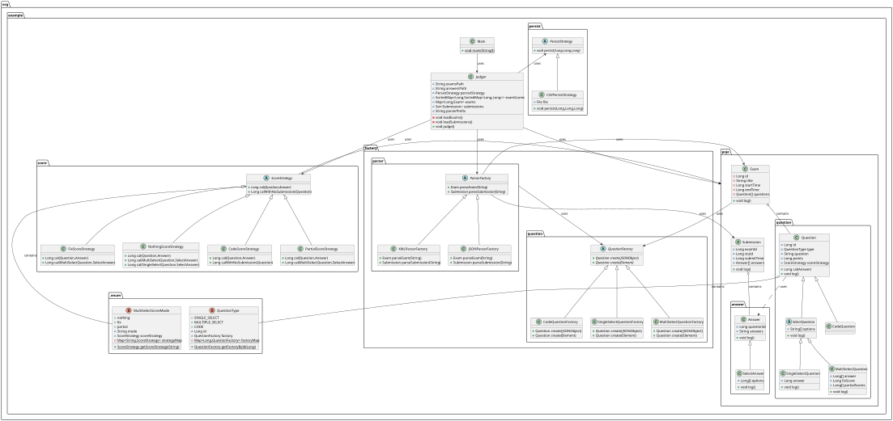
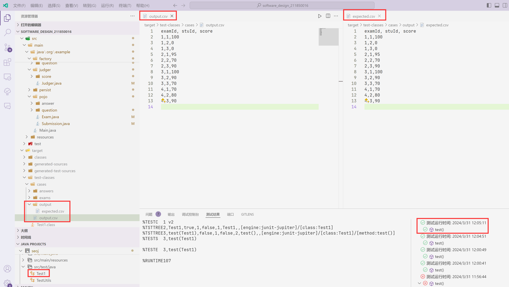

# 软件设计文档

> 211850016 李薛成

## 设计概述

在线评测系统（Online Judge）是允许用户提交自己的代码，让系统测试程序能否在给定的测试用例下正常运行，从而检验程序的正确性、空间与时间消耗等信息的系统。

### 功能概述

系统主要功能包括：

- 题目读取：读取存储在本地 exams 和 answers 文件夹中的题目和提交信息
- 评分：根据读取到的 exam 和 answer 信息对 answer 进行打分，并将结果输出到 CSV 文件中
- ……

### 系统架构

系统主要分为以下几个模块：

- Judger 模块：驱动整个评测过程，包括读取考试与题目、读取提交信息、评分、持久化。它聚合了 Exam 类与 Submission 类，调用 ParserFactory 读取考试与题目，在评测得出分数后，调用 PersistStrategy 将结果持久化到文件中。
- Parser 模块：负责解析 JSON、XML 文件，将文件解析为内存中的数据结构，以便 Judger 模块使用，使用了工厂方法模式，完全符合“开闭原则”。
- Score 模块：负责评分，根据题目信息，对提交信息进行评分，返回得分，使用了策略模式，有四种评分策略：代码给分、Nothing 给分、Fix 给分、Partial 给分。
- Persist 模块：负责将 Judger 模块评测得出的结果持久化到 CSV 文件中，使用了策略模式，目前只有 CSV 这一种策略。

### UML 类图

### 接口定义

| 类名                        | 方法名              | 参数类型                           | 返回值类型      | 描述             |
| --------------------------- | ------------------- | ---------------------------------- | --------------- | ---------------- |
| Judger                      | loadExams           | -                                  | void            | 加载考试         |
| Judger                      | loadSubmissions     | -                                  | void            | 加载提交         |
| Judger                      | judge               | -                                  | void            | 评判             |
| SelectQuestion              | log                 | -                                  | void            | 记录日志         |
| CodeScoreStrategy           | cal                 | Question, Answer                   | Long            | 计算分数         |
| CodeScoreStrategy           | calWithNoSubmission | Question                           | Long            | 计算无提交的分数 |
| Question                    | cal                 | Answer                             | Long            | 计算分数         |
| Question                    | log                 | -                                  | void            | 记录日志         |
| SingleSelectQuestion        | log                 | -                                  | void            | 记录日志         |
| MultiSelectScoreMode        | getScoreStrategy    | String                             | ScoreStrategy   | 获取评分策略     |
| PartialScoreStrategy        | cal                 | Question, Answer                   | Long            | 计算部分分数     |
| PartialScoreStrategy        | cal                 | MultiSelectQuestion, SelectAnswer  | Long            | 计算部分分数     |
| SelectAnswer                | log                 | -                                  | void            | 记录日志         |
| CodeQuestionFactory         | create              | JSONObject                         | Question        | 创建题目         |
| CodeQuestionFactory         | create              | Element                            | Question        | 创建题目         |
| QuestionType                | getFactoryById      | Long                               | QuestionFactory | 根据ID获取工厂   |
| Exam                        | log                 | -                                  | void            | 记录日志         |
| SingleSelectQuestionFactory | create              | JSONObject                         | Question        | 创建单选题       |
| SingleSelectQuestionFactory | create              | Element                            | Question        | 创建单选题       |
| QuestionFactory             | create              | JSONObject                         | Question        | 创建题目         |
| QuestionFactory             | create              | Element                            | Question        | 创建题目         |
| PersistStrategy             | persist             | Long, Long, Long                   | void            | 持久化           |
| ParserFactory               | parseExam           | String                             | Exam            | 解析考试         |
| ParserFactory               | parseSubmission     | String                             | Submission      | 解析提交         |
| CSVPersistStrategy          | persist             | Long, Long, Long                   | void            | 持久化           |
| Answer                      | log                 | -                                  | void            | 记录日志         |
| FixScoreStrategy            | cal                 | Question, Answer                   | Long            | 计算分数         |
| FixScoreStrategy            | cal                 | MultiSelectQuestion, SelectAnswer  | Long            | 计算分数         |
| NothingScoreStrategy        | cal                 | Question, Answer                   | Long            | 计算分数         |
| NothingScoreStrategy        | cal                 | MultiSelectQuestion, SelectAnswer  | Long            | 计算分数         |
| NothingScoreStrategy        | cal                 | SingleSelectQuestion, SelectAnswer | Long            | 计算分数         |
| MultiSelectQuestion         | log                 | -                                  | void            | 记录日志         |
| XMLParserFactory            | parseExam           | String                             | Exam            | 解析考试         |
| XMLParserFactory            | parseSubmission     | String                             | Submission      | 解析提交         |
| JSONParserFactory           | parseExam           | String                             | Exam            | 解析考试         |
| JSONParserFactory           | parseSubmission     | String                             | Submission      | 解析提交         |
| Submission                  | log                 | -                                  | void            | 记录日志         |
| MultiSelectQuestionFactory  | create              | JSONObject                         | Question        | 创建多选题       |
| MultiSelectQuestionFactory  | create              | Element                            | Question        | 创建多选题       |

## 功能演示

从图中可以看出，系统成功通过了 Test1，加载了试卷和提交信息，评判了提交信息，并将结果持久化到了 CSV 文件中。