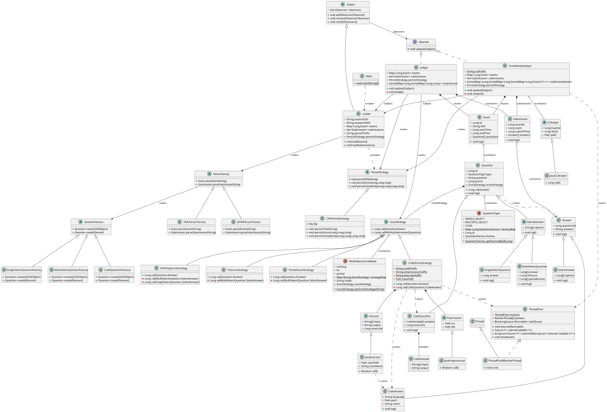
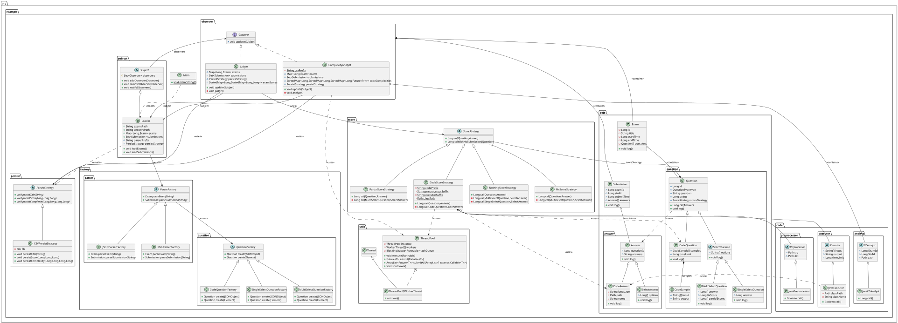
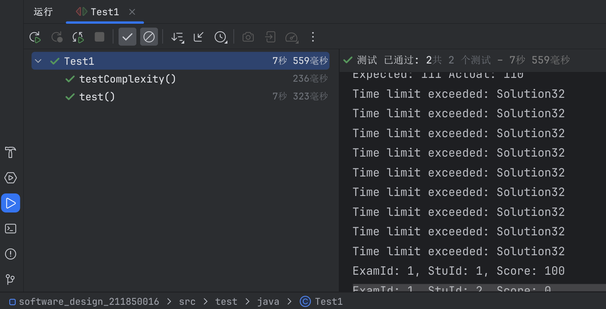
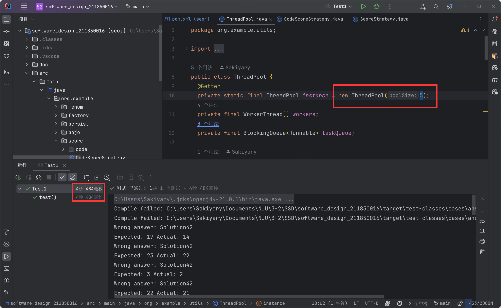

# 软件设计文档

> 211850016 李薛成

## 设计概述

在线评测系统（Online Judge）是允许用户提交自己的代码，让系统测试程序能否在给定的测试用例下正常运行，从而检验程序的正确性、空间与时间消耗等信息的系统。

### 功能概述

系统主要功能包括：

- 题目读取：读取存储在本地 exams 和 answers 文件夹中的题目和提交信息。
- 评分：根据读取到的 exam 和 answer 信息对 answer 进行打分，并将结果输出到 CSV 文件中。
  - 选择题：根据选择题的答案进行评分。
  - 代码题：根据代码题的编译与运行结果进行评分，为支持多种语言留出接口，目前支持 Java 语言。对编译错误、运行错误、运行超时等情况均有相应的处理。
- 圈复杂度分析：对代码题所提交代码的圈复杂度进行分析，并将结果输出到 CSV 文件中。

### 系统架构

- Loader 模块：负责加载考试与题目、加载提交信息。它与 Judger 模块、ComplexityAnalyst 模块形成**观察者模式**，当 Loader 模块加载完数据后，会根据需求通知 Judger 模块开始评测/通知 ComplexityAnalyst 模块开始分析圈复杂度。它聚合了 Exam 类与 Submission 类，通过**反射**调用 ParserFactory 读取考试与题目，符合开闭原则。
- Parser 模块：负责解析 JSON、XML 文件，将文件解析为内存中的数据结构，以便 Judger 模块使用，使用了**工厂方法模式**，完全符合开闭原则。
- Judger 模块：驱动整个评测过程，包括评分、持久化。它在评测得出分数后，调用 PersistStrategy 将结果持久化到文件中。
- ComplexityAnalyst 模块：负责分析圈复杂度、持久化。它在分析得出圈复杂度后，调用 PersistStrategy 将结果持久化到文件中。
- Persist 模块：负责将 Judger 模块评测 / ComplexityAnalyst 模块分析得出的结果持久化到 CSV 文件中，使用了**策略模式**，目前仅有 CSV 这一种策略。
- Score 模块：负责评分，根据题目信息，对提交信息进行评分，返回得分，使用了**策略模式**，有四种评分策略：代码给分、Nothing 给分、Fix 给分、 Partial 给分。其中代码给分调用了 Code 模块，具体见下。
- Code 模块：
  - 在评分时使用了**模板方法**将代码题的编译（预处理）与运行（后处理）分离，使得可以评测多种语言的代码，在 CodeScoreStrategy 中调用时设计了**反射**，使得可以直接调用不同语言的评分模板，完全符合开闭原则。对编译错误、运行错误、运行超时等情况均有相应的处理。**且不会产生线程泄露、内存泄露等问题。**
  - 在分析复杂度时，同样使用了**模板方法**，目前仅有圈复杂度这一种复杂度分析方法，使得可以分析多种语言的代码，在 ComplexityAnalyst 模块中调用时设计了**反射**，完全符合开闭原则。
  - **编译、运行、分析圈复杂度**的过程中，**均调用了线程池** ThreadPool 来加速。
- ThreadPool 模块：提供线程池，用于并行编译与评测代码题的不同测试用例，或并行分析多份代码，提高评测与分析效率。

### UML 类图

迭代三的总 UML 类图如下，为使类图更加清晰，省略了包的框：

包含包的框的类图如下

### 设计总结

在迭代三中主要修改了 Judger 模块的设计模式，将其从没有设计模式，根据需求变更，改为观察者模式。使得 Loader 模块加载完数据后，能够通知 Judger 模块开始评测，同时，可以通知 ComplexityAnalyst 模块开始分析复杂度。这样的设计使得系统更加灵活，符合开闭原则。

在前两次迭代中设计的其他模式我认为均较为合理，没有进行修改。如 Parser 模块使用了工厂方法模式，使得可以解析多种格式的文件；Persist 模块使用了策略模式，使得可以持久化到多种格式的文件；Score 模块使用了策略模式，使得可以评分多种题目；Code 模块使用了模板方法模式，使得可以评测 / 分析多种语言的代码。这些模块全都符合开闭原则。

新增的 ComplexityAnalyst 模块由观察者模式驱动，内部使用模板方法模式，可以分析多种语言的代码，同样较为合理。

迭代二中实现的线程池工具并无设计模式，但在迭代三中同样为分析圈复杂度提供了加速，可见线程池的设计是正确的、合理的。

故个人认为整体设计较为合理，充分利用了课上所学的设计模式，使得系统更加灵活，符合开闭原则，易于扩展。

### 接口定义

| 类名                        | 方法名              | 参数类型                           | 返回值类型           | 描述                       |
| --------------------------- | ------------------- | ---------------------------------- | -------------------- | -------------------------- |
| Loader                      | loadExams           | -                                  | void                 | 加载考试                   |
| Loader                      | loadSubmissions     | -                                  | void                 | 加载提交                   |
| Judger                      | judge               | -                                  | void                 | 评测分数                   |
| ComplexityAnalyst           | analyze             | -                                  | void                 | 分析圈复杂度               |
| Subject                     | addObserver         | Observer                           | void                 | 添加观察者                 |
| Subject                     | removeObserver      | Observer                           | void                 | 移除观察者                 |
| Subject                     | notifyObservers     | -                                  | void                 | 通知观察者                 |
| Observer                    | update              | Subject                           | void                 | 更新数据并操作              |
| SelectQuestion              | log                 | -                                  | void                 | 记录日志                   |
| CodeScoreStrategy           | cal                 | Question, Answer                   | Long                 | 计算分数                   |
| CodeScoreStrategy           | calWithNoSubmission | Question                           | Long                 | 计算无提交的分数           |
| Question                    | cal                 | Answer                             | Long                 | 计算分数                   |
| Question                    | log                 | -                                  | void                 | 记录日志                   |
| SingleSelectQuestion        | log                 | -                                  | void                 | 记录日志                   |
| MultiSelectScoreMode        | getScoreStrategy    | String                             | ScoreStrategy        | 获取评分策略               |
| PartialScoreStrategy        | cal                 | Question, Answer                   | Long                 | 计算部分分数               |
| PartialScoreStrategy        | cal                 | MultiSelectQuestion, SelectAnswer  | Long                 | 计算部分分数               |
| SelectAnswer                | log                 | -                                  | void                 | 记录日志                   |
| CodeQuestionFactory         | create              | JSONObject                         | Question             | 创建题目                   |
| CodeQuestionFactory         | create              | Element                            | Question             | 创建题目                   |
| QuestionType                | getFactoryById      | Long                               | QuestionFactory      | 根据ID获取工厂             |
| Exam                        | log                 | -                                  | void                 | 记录日志                   |
| SingleSelectQuestionFactory | create              | JSONObject                         | Question             | 创建单选题                 |
| SingleSelectQuestionFactory | create              | Element                            | Question             | 创建单选题                 |
| QuestionFactory             | create              | JSONObject                         | Question             | 创建题目                   |
| QuestionFactory             | create              | Element                            | Question             | 创建题目                   |
| PersistStrategy             | persist             | Long, Long, Long                   | void                 | 持久化                     |
| ParserFactory               | parseExam           | String                             | Exam                 | 解析考试                   |
| ParserFactory               | parseSubmission     | String                             | Submission           | 解析提交                   |
| CSVPersistStrategy          | persist             | Long, Long, Long                   | void                 | 持久化                     |
| Answer                      | log                 | -                                  | void                 | 记录日志                   |
| FixScoreStrategy            | cal                 | Question, Answer                   | Long                 | 计算分数                   |
| FixScoreStrategy            | cal                 | MultiSelectQuestion, SelectAnswer  | Long                 | 计算分数                   |
| NothingScoreStrategy        | cal                 | Question, Answer                   | Long                 | 计算分数                   |
| NothingScoreStrategy        | cal                 | MultiSelectQuestion, SelectAnswer  | Long                 | 计算分数                   |
| NothingScoreStrategy        | cal                 | SingleSelectQuestion, SelectAnswer | Long                 | 计算分数                   |
| MultiSelectQuestion         | log                 | -                                  | void                 | 记录日志                   |
| XMLParserFactory            | parseExam           | String                             | Exam                 | 解析考试                   |
| XMLParserFactory            | parseSubmission     | String                             | Submission           | 解析提交                   |
| JSONParserFactory           | parseExam           | String                             | Exam                 | 解析考试                   |
| JSONParserFactory           | parseSubmission     | String                             | Submission           | 解析提交                   |
| Submission                  | log                 | -                                  | void                 | 记录日志                   |
| MultiSelectQuestionFactory  | create              | JSONObject                         | Question             | 创建多选题                 |
| MultiSelectQuestionFactory  | create              | Element                            | Question             | 创建多选题                 |
| CodeAnswer                  | log                 | -                                  | void                 | 记录日志                   |
| ThreadPool                  | execute             | Runnable                           | void                 | 执行一个任务               |
| ThreadPool                  | submit              | Callable<T>                        | Future<T>            | 提交一个返回结果的任务     |
| ThreadPool                  | submitAll           | ArrayList<? extends Callable<T>>   | ArrayList<Future<T>> | 提交多个任务并返回结果列表 |
| ThreadPool                  | shutdown            | -                                  | void                 | 关闭线程池                 |
| WorkerThread                | run                 | -                                  | void                 | 线程执行的方法             |
| JavaPreprocessor            | call                | -                                  | Boolean              | 执行 Java 预处理           |
| JavaExecutor                | call                | -                                  | Boolean              | 执行 Java 代码并返回结果   |
| JavaCCAnalyst               | call                | -                                  | Long                 | 分析 Java 代码的圈复杂度   |

## 功能演示

### 迭代三功能演示

完成了代码题评测时运行超时的处理，并可以正确计算出分数与圈复杂度。

### 迭代二功能演示

开启线程池并发后，可以看到代码题的评测速度较快，且能得出正确的评分结果。

可以对比以下未开启多线程的评分结果。

