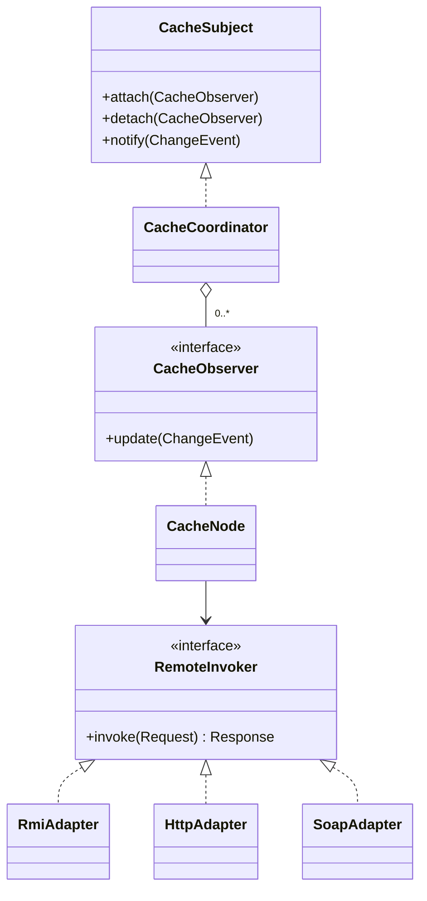

# 2015 年软件系统设计原题与答案

## 资料信息

- **原题出处**：[2015 年扫描卷第 1 页](../../往年题/2015/1.jpg)、[第 2 页](../../往年题/2015/2.jpg)、[第 3 页](../../往年题/2015/3.jpg)
- **合并来源**：[2015、2017、2018、2019押题、2019.pdf](<../../往年题/2015、2017、2018、2019押题、2019.pdf>)
- **现有答案来源**：[Exam0-往年考试.pdf](../../往年题/Exam0-往年考试.pdf)、[往年考题综合.docx](../../往年题/往年考题综合.docx)、[往年题整理](../../往年题整理/)
- **试卷性质**：正式扫描卷；第 12 题只有架构图清晰可见，小问未完整恢复。

## 一、简答题

### 1. Where do software architectures come from? List five possible sources.

**现有答案（非官方）**

`往年考题综合.docx` 给出的要点是：非功能需求、架构重要需求、质量需求、利益相关者、组织、技术环境，以及业务和技术决策。

**AI 校核答案**

软件架构不是凭空产生的，它受系统上下文中的多种力量共同约束。任选五项并解释即可：

1. **功能需求**：决定系统必须提供哪些核心职责和交互。
2. **质量属性需求**：性能、可用性、安全性、可修改性等往往直接决定结构。
3. **业务目标与约束**：上市时间、预算、产品线复用、合规要求等。
4. **利益相关者关注点**：用户、开发者、运维者、客户和管理者关注不同问题。
5. **组织结构与能力**：团队边界、技能、沟通方式会影响模块与服务的划分。
6. **技术环境与既有系统**：平台、中间件、遗留系统、标准和第三方接口。
7. **架构师经验及既有方案**：架构模式、参考架构、历史设计决策和风险经验。

答题时写成“来源 + 如何影响架构”，比只列名词更完整。

相关资料：[软件架构简答题](../../往年题整理/01-简答题-软件架构部分.md)

### 2. 软件产品线（SPL）架构与单一产品架构有何不同？

**现有答案（非官方）**

现有整理认为：单一产品面向当前需求；产品线架构同时表达多个产品的共性与可变性，并通过变异点和绑定机制支持复用。

**AI 校核答案**

- **目标不同**：单一产品架构优化一个系统；SPL 架构优化一族相关产品及长期复用。
- **需求模型不同**：SPL 同时管理 commonality 与 variability，需明确必选、可选、互斥或组合特征。
- **结构不同**：SPL 设置变异点，并用配置、参数化、插件、继承、条件编译等机制实现变体。
- **决策时机不同**：变体可在设计、编译、部署或运行时绑定；越晚越灵活，但实现、测试和运行成本通常越高。
- **评价标准不同**：除单个产品质量外，还关注复用收益、派生效率、变体一致性和演化成本。

相关资料：[软件架构简答题](../../往年题整理/01-简答题-软件架构部分.md)

### 3. 如何对质量属性场景建模？分别给出可用性和性能场景。

**现有答案（非官方）**

现有整理使用六要素：刺激源、刺激、环境、制品、响应、响应度量。

**AI 校核答案**

质量属性场景应包含六部分：`Source`、`Stimulus`、`Environment`、`Artifact`、`Response`、`Response Measure`。最后的可测量指标不可省略。

**可用性示例**：正常运行时，监控器发现主数据库无响应；故障作用于数据库服务；系统在 5 秒内检测故障并切换到备库，未提交事务可重试；月度可用性不低于 99.9%，数据丢失不超过 1 秒。

**性能示例**：业务高峰期，1000 个并发用户向查询服务持续发起请求；系统完成鉴权、查询并返回结果；95% 请求响应时间小于 2 秒，吞吐量不少于 500 req/s，错误率低于 0.1%。

相关资料：[质量属性与场景](../../往年题整理/02-简答题-质量属性与场景.md)

### 4. 架构模式与架构策略（tactics）有什么关系？列出四种策略及其目的。

**现有答案（非官方）**

现有整理将模式视为反复出现问题的整体结构方案，将策略视为影响某一质量属性响应的基本设计决策。

**AI 校核答案**

模式规定一组元素、关系和约束，是较宏观且可识别的结构；策略是更细粒度的设计手段，直接控制质量属性响应。一个模式通常组合多种策略；同一种策略也可出现在不同模式中。模式带来的质量效果仍应拆解到具体策略分析。

可列四项：

1. **Heartbeat/Ping-Echo**：检测故障，提高可用性。
2. **Active Redundancy**：并行冗余并快速接管，提高可用性。
3. **Caching**：减少重复计算或远程访问，改善性能。
4. **Resource Pooling**：复用昂贵资源，改善吞吐量和响应时间。
5. **Abstract Common Services**：隔离变化，提高可修改性。
6. **Authenticate Actors**：验证主体身份，提高安全性。

任选四项时必须写“策略名 + 目标质量属性 + 作用”。

相关资料：[架构模式与策略](../../往年题整理/03-简答题-架构模式与策略.md)

### 5. 一般的软件架构过程包含哪些活动？

**现有答案（非官方）**

现有资料常列：需求/驱动因素分析、架构设计、文档化、评价、实现与演化。

**AI 校核答案**

1. **识别架构驱动因素**：业务目标、ASR、约束和主要风险。
2. **架构设计**：选择模式和策略，分解系统，分配职责，定义接口。
3. **架构建模与文档化**：用多个视图记录结构、行为和设计理由。
4. **架构评价**：用场景走查、原型或 ATAM 发现风险、敏感点和权衡点。
5. **实现与一致性检查**：保证代码、部署和运行结构符合设计。
6. **架构演化**：根据需求、技术和风险变化更新架构与决策记录。

这是迭代过程，各活动会反复发生，不是严格瀑布顺序。

相关资料：[软件架构简答题](../../往年题整理/01-简答题-软件架构部分.md)

### 6. 将给定问题映射到 Module、C&C、Allocation 结构，并为每类列出四种视图。

**现有答案（非官方）**

现有整理按“实现单元、运行时元素、软件与环境映射”区分三类结构。

**AI 校核答案**

- **Module** 回答“代码如何分解、职责和依赖是什么”。常见视图：Decomposition、Uses、Layered、Class/Generalization。
- **Component-and-Connector** 回答“运行时有哪些组件、如何交互、数据怎样流动”。常见视图：Communicating Processes、Concurrency、Shared Data、Client-Server（或 SOA/Pipe-and-Filter）。
- **Allocation** 回答“软件元素被放到哪里”。常见视图：Deployment、Implementation、Work Assignment、Install。

映射原则：题目问编译/开发/静态依赖选 Module；问运行时通信选 C&C；问机器、目录、团队或安装位置选 Allocation。

相关资料：[软件架构简答题](../../往年题整理/01-简答题-软件架构部分.md)

### 7. Broker 模式的上下文、优点和局限是什么？

**现有答案（非官方）**

现有资料强调 Broker 通过中介协调分布式客户端和服务，提供位置透明与解耦，但增加间接层、性能开销和单点风险。

**AI 校核答案**

**上下文**：分布式、异构环境中，客户端需要调用位置可能变化、接口或通信机制不同的远程服务。

**结构**：Client 通过 Client Proxy 向 Broker 请求；Broker 定位服务并经 Server Proxy/Skeleton 调用 Server；Bridge 可连接不同 Broker。

**优点**：位置透明；客户端与服务端解耦；便于服务注册、替换、扩展及异构互操作；通信细节被代理封装。

**局限**：多一次或多次间接调用，增加延迟；Broker 可能成为性能瓶颈和单点故障；故障定位、安全、版本兼容与分布式调试更复杂。

相关资料：[架构模式与策略](../../往年题整理/03-简答题-架构模式与策略.md)

### 8. 为什么架构文档需要多个视图？举出四种视图及用途。

**现有答案（非官方）**

现有答案认为单一图无法表达全部关注点，不同利益相关者需要不同结构。

**AI 校核答案**

系统同时存在静态代码结构、运行时交互和环境映射，一张图无法完整且清晰地表达；不同利益相关者还关心不同问题。多个视图可以分离关注点、控制复杂度，并支持开发、分析、部署和沟通。

可答：

1. **Decomposition View**：展示模块分解和职责。
2. **Uses View**：展示模块依赖，分析增量开发与变更影响。
3. **Communicating-Processes View**：展示运行时进程与通信，分析性能和并发。
4. **Deployment View**：展示软件到硬件节点的映射，分析可用性、容量和网络影响。

相关资料：[软件架构简答题](../../往年题整理/01-简答题-软件架构部分.md)

### 9. SOA 的原则及其对互操作性、可伸缩性、安全性的影响。

**现有答案（非官方）**

现有资料列出标准化契约、松耦合、抽象、复用、自治、无状态、可发现和可组合等原则。

**AI 校核答案**

- **互操作性**：标准化服务契约、平台中立消息和明确数据格式使异构系统协作；版本不兼容和语义差异仍需治理。
- **可伸缩性**：服务自治、无状态和粗粒度接口便于独立复制及负载均衡；集中式 ESB 或共享数据库可能成为瓶颈。
- **安全性**：统一契约和中介层有利于集中认证、授权、审计和策略执行；但跨网络调用、服务链和更大攻击面使身份传播、消息保护和密钥管理更复杂。

答题时应体现“原则产生正面效果，同时带来代价”，而不是只写优点。

相关资料：[架构模式与策略](../../往年题整理/03-简答题-架构模式与策略.md)

### 10. ATAM 各阶段的输出是什么？

**现有答案（非官方）**

现有整理主要输出包括：业务驱动、架构表示、质量属性效用树、场景优先级、风险/非风险、敏感点和权衡点。

**AI 校核答案**

按经典九步法可归入四阶段：

1. **准备/陈述阶段**：评价范围、参与者和计划；业务驱动因素；架构表示及其主要方法。
2. **调查分析阶段**：质量属性效用树及优先级；对高优先级场景的架构方法分析；初步风险、非风险、敏感点和权衡点。
3. **测试阶段**：利益相关者头脑风暴得到的场景集合及投票排序；对新增高优先级场景的复核；更新后的风险清单。
4. **报告阶段**：评价结果报告，包括风险主题、风险/非风险、敏感点、权衡点、场景和改进建议。

相关资料：[软件架构简答题](../../往年题整理/01-简答题-软件架构部分.md)

### 11. SPL 与 MDA 如何实现高复用？比较异同。

**现有答案（非官方）**

现有整理认为两者都通过抽象和系统化转换提高复用；SPL 以产品族共性/可变性为中心，MDA 以模型及模型转换为中心。

**AI 校核答案**

**共同点**：都把复用提升到系统化工程层面；通过抽象、标准化资产和自动化减少重复开发；都需要明确变化与平台约束。

**SPL**：建立产品线核心资产，包括参考架构、公共组件、特征模型和变异机制；通过产品配置与变体绑定派生具体产品。复用对象是同一领域产品族中的共性资产。

**MDA**：先建立平台无关模型 PIM，再通过模型转换得到平台特定模型 PSM，最终生成或指导实现。复用对象主要是模型、元模型和转换规则，重点是跨平台与抽象层次迁移。

**差异**：SPL 的主要变化轴是“产品差异”，MDA 的主要变化轴是“平台差异”；两者可结合，即产品线特征选择后再进行模型转换。

相关资料：[软件架构简答题](../../往年题整理/01-简答题-软件架构部分.md)

## 二、综合设计题

### 12. 分布式缓存系统设计

**原题恢复情况**

扫描卷第 3 页保留了一张分布式缓存架构图，但小问文字未完整恢复。2019 回忆资料明确称其综合题与 2015 年相同；[2022 年 A 卷](../2022/原题与答案.md)又给出了完整的同主题题目。因此这里只回答可以确认的设计目标，不把 2022 的小问伪装成 2015 原文。

**现有答案（非官方）**

[综合设计题整理](../../往年题整理/05-综合设计题.md)采用 Observer 完成缓存更新通知，并用 Adapter/Bridge 或统一远程调用抽象屏蔽 RMI、HTTP/JSP、SOAP 等异构协议。

**AI 校核答案**

核心问题有两个：缓存一致性通知和异构通信。

1. **缓存一致性**：把数据源或缓存协调器作为 `Subject`，各缓存节点作为 `Observer`。数据变更后 Subject 发布失效事件；缓存节点收到事件后删除旧值或拉取新值。若允许最终一致性，应配合版本号、TTL、重试和幂等处理。
2. **异构协议**：定义统一的 `CacheEndpoint`/`RemoteInvoker` 接口，每种协议由一个 Adapter 实现；若“操作类型”和“传输协议”都独立变化，可使用 Bridge，将缓存操作抽象与 RMI、HTTP、SOAP 实现分离。
3. **可靠性**：通知失败进入重试队列；节点恢复后按版本补偿；服务注册/发现负责节点动态加入和退出。
4. **并发正确性**：更新事件携带 key、版本和操作类型；节点只接受更新版本，防止乱序消息覆盖新值。

相关资料：[综合设计题](../../往年题整理/05-综合设计题.md)、[设计模式题答题模板](../../../考试重点/03-综合设计题/答题模板.md)

