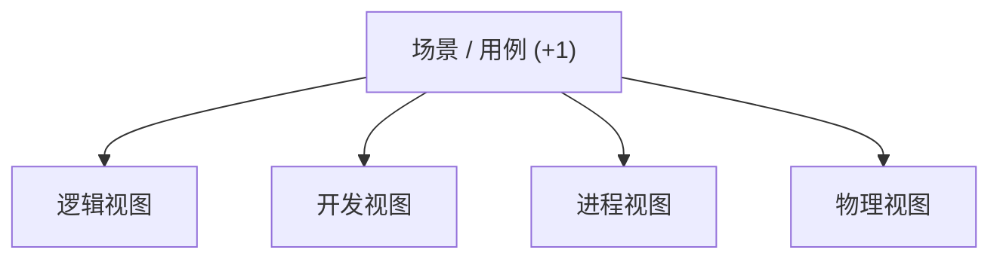

# 2017 年软件系统设计原题与答案

## 资料信息

- **原题出处**：[2015、2017、2018、2019押题、2019.pdf](<../../往年题/2015、2017、2018、2019押题、2019.pdf>)、[往年考题综合.docx](../../往年题/往年考题综合.docx)
- **现有答案来源**：[Exam0-往年考试.pdf](../../往年题/Exam0-往年考试.pdf)、[往年题整理](../../往年题整理/)
- **试卷性质**：考后回忆整理，未发现正式试卷或官方答案；现有资料只恢复了 11 道简答题。

## 1. 软件架构过程有哪些活动？主要输入和输出是什么？

**现有答案（非官方）**：现有整理列出架构需求分析、设计、文档化、评价、实现与演化。

**AI 校核答案**：需求分析以业务目标、功能需求、质量属性、约束和利益相关者关注点为输入，输出 ASR、质量属性场景与风险；架构设计以这些驱动因素为输入，输出架构元素、职责、接口、模式/策略和设计决策；文档化输出多视图及理由；评价输入架构和高优先级场景，输出风险、非风险、敏感点、权衡点与改进建议；实现和一致性检查输出可运行系统及偏差记录；演化输入新需求和反馈，输出更新后的架构与决策。各活动是迭代关系。

资料：[软件架构简答题](../../往年题整理/01-简答题-软件架构部分.md)

## 2. SPL 架构与单一产品架构的区别

**现有答案（非官方）**：SPL 同时描述共性与可变性，单一产品只面向一个需求集合。

**AI 校核答案**：SPL 面向产品族，维护核心资产、特征模型、变异点和绑定机制；单一产品架构以当前产品的功能和质量目标为中心。SPL 前期投入和治理成本更高，但能提高后续产品派生速度与一致性；绑定越晚，灵活性越高，但实现、测试和运行复杂度也越高。

资料：[软件架构简答题](../../往年题整理/01-简答题-软件架构部分.md)

## 3. 通用架构设计策略有哪些？结合架构实例说明。

**现有答案（非官方）**：现有资料通常概括为分解、抽象、复用、生成、隔离和分布等策略。

**AI 校核答案**：可从“降低复杂度、控制依赖、满足质量属性”组织答案：

1. **分解与职责分配**：按变化原因或业务能力拆分模块，例如分层架构将 UI、业务、数据访问分开。
2. **抽象与信息隐藏**：用稳定接口隐藏实现，例如 Repository 隔离数据库变化。
3. **复用成熟方案**：采用模式、框架和参考架构，例如 MVC 分离表示与模型。
4. **间接与中介**：加入 Broker、事件总线或 Facade，降低直接耦合。
5. **冗余与复制**：主备、集群和缓存改善可用性/性能。
6. **推迟绑定**：配置、插件和依赖注入提高可修改性。

应说明策略也有代价，例如中介增加延迟、冗余增加一致性成本。

资料：[架构模式与策略](../../往年题整理/03-简答题-架构模式与策略.md)

## 4. 用质量属性场景描述可用性和可修改性

**现有答案（非官方）**：采用刺激源、刺激、环境、制品、响应、响应度量六要素。

**AI 校核答案**：

- **可用性**：正常运行时，监控系统发现主服务进程崩溃；故障作用于订单服务；系统隔离故障并切换到备用实例；30 秒内恢复，已确认订单不丢失，月可用性不低于 99.9%。
- **可修改性**：开发期，产品经理要求新增一种支付渠道；变更作用于支付模块；开发者通过扩展支付接口加入实现，不修改订单核心逻辑；1 人在 2 个工作日内完成，回归影响不超过 5 个模块。

资料：[质量属性与场景](../../往年题整理/02-简答题-质量属性与场景.md)

## 5. ATAM 的各阶段输出

**现有答案（非官方）**：业务驱动、架构表示、效用树、场景优先级，以及风险/非风险、敏感点、权衡点和风险主题。

**AI 校核答案**：准备与陈述阶段输出评价计划、业务驱动和架构描述；调查分析阶段输出效用树、高优先级场景分析及初步风险/敏感点/权衡点；测试阶段输出利益相关者场景及排序、更新后的分析结果；报告阶段输出最终评价报告、风险主题和改进建议。ATAM 评价的是架构决策对质量目标的影响，不是给架构打单一分数。

资料：[软件架构简答题](../../往年题整理/01-简答题-软件架构部分.md)

## 6. Module、C&C、Allocation 如何映射问题？各举四种视图。

**现有答案（非官方）**：三类分别表达实现单元、运行时交互和软件到环境的映射。

**AI 校核答案**：Module 适合静态代码分解，视图可为 Decomposition、Uses、Layered、Class；C&C 适合运行时组件和连接件，视图可为 Communicating Processes、Concurrency、Shared Data、Client-Server；Allocation 适合映射机器、目录、团队和安装环境，视图可为 Deployment、Implementation、Work Assignment、Install。

资料：[软件架构简答题](../../往年题整理/01-简答题-软件架构部分.md)

## 7. 什么是 ASR？列出四种来源或获取方法。

**现有答案（非官方）**：ASR 是对架构结构或关键决策有显著影响的需求，可来自业务目标、质量属性、约束和核心功能。

**AI 校核答案**：ASR（Architecturally Significant Requirement）是若处理不当会显著改变架构、成本或风险的需求。来源/方法可答：访谈利益相关者并分析业务目标；把质量属性具体化为场景并排序；分析技术、法律、预算和遗留约束；识别高风险核心功能和外部接口；审查用例、原型、既有系统及历史故障。注意 ASR 不等于所有非功能需求，也可能是关键功能需求。

资料：[软件架构简答题](../../往年题整理/01-简答题-软件架构部分.md)

## 8. Strategy 模式体现了至少哪些面向对象原则？

**现有答案（非官方）**：现有整理主要列 OCP、DIP、封装变化、组合优于继承。

**AI 校核答案**：

1. **封装变化**：把可变算法封装为独立 Strategy。
2. **面向接口编程/DIP**：Context 依赖 Strategy 抽象，不依赖具体算法。
3. **OCP**：新增策略通常只新增类，无需修改 Context。
4. **组合优于继承**：Context 通过组合持有策略，可在运行时替换。
5. 若各策略能互换且不破坏客户端预期，也体现 **LSP**。

资料：[设计模式简答题](../../往年题整理/04-简答题-设计模式部分.md)

## 9. 一套完整的架构文档包应包含什么？

**现有答案（非官方）**：现有资料包括文档路线图、视图、跨视图信息和设计理由。

**AI 校核答案**：应包含：文档目的、范围和利益相关者；视图目录/路线图；每个视图的主表示、元素目录、上下文图、变化指南与设计理由；跨视图映射；接口、行为和数据说明；架构决策记录；术语表；已知限制、风险及追踪关系。只给几张 UML 图不构成完整架构文档。

资料：[软件架构简答题](../../往年题整理/01-简答题-软件架构部分.md)

## 10. 解释 4+1 视图模型

**现有答案（非官方）**：逻辑、开发、进程、物理四个视图，由场景视图贯穿验证。

**AI 校核答案**：逻辑视图表达领域对象和功能分解；开发视图表达代码模块、包和开发组织；进程视图表达运行时进程、线程、通信与同步；物理视图表达软件在硬件节点上的部署；“+1”场景/用例把关键需求映射到四个视图，用来发现遗漏并验证它们相互一致。

资料：[软件架构简答题](../../往年题整理/01-简答题-软件架构部分.md)

## 11. 软件产品线的三个变化维度/变异点是什么？绑定时间如何影响可修改性和可测试性？

**现有答案（非官方）**：现有整理常从特征、实现和绑定时间描述变化；越晚绑定越灵活，但测试空间更大。

**AI 校核答案**：课程口径可能写成三个维度：**变化内容/特征**（选什么）、**变化机制/实现方式**（如何替换）、**绑定时间**（何时确定）。也可把变异点按可选、替代和集合型分类，答题时应先说明采用的口径。设计/编译期绑定结构简单、易静态分析和测试，但修改通常需重新构建；部署/运行期绑定可修改性和配置灵活性更高，却增加配置组合、动态错误和回归测试范围。测试应覆盖合法配置、变异点交互及各绑定阶段。

资料：[软件架构简答题](../../往年题整理/01-简答题-软件架构部分.md)

