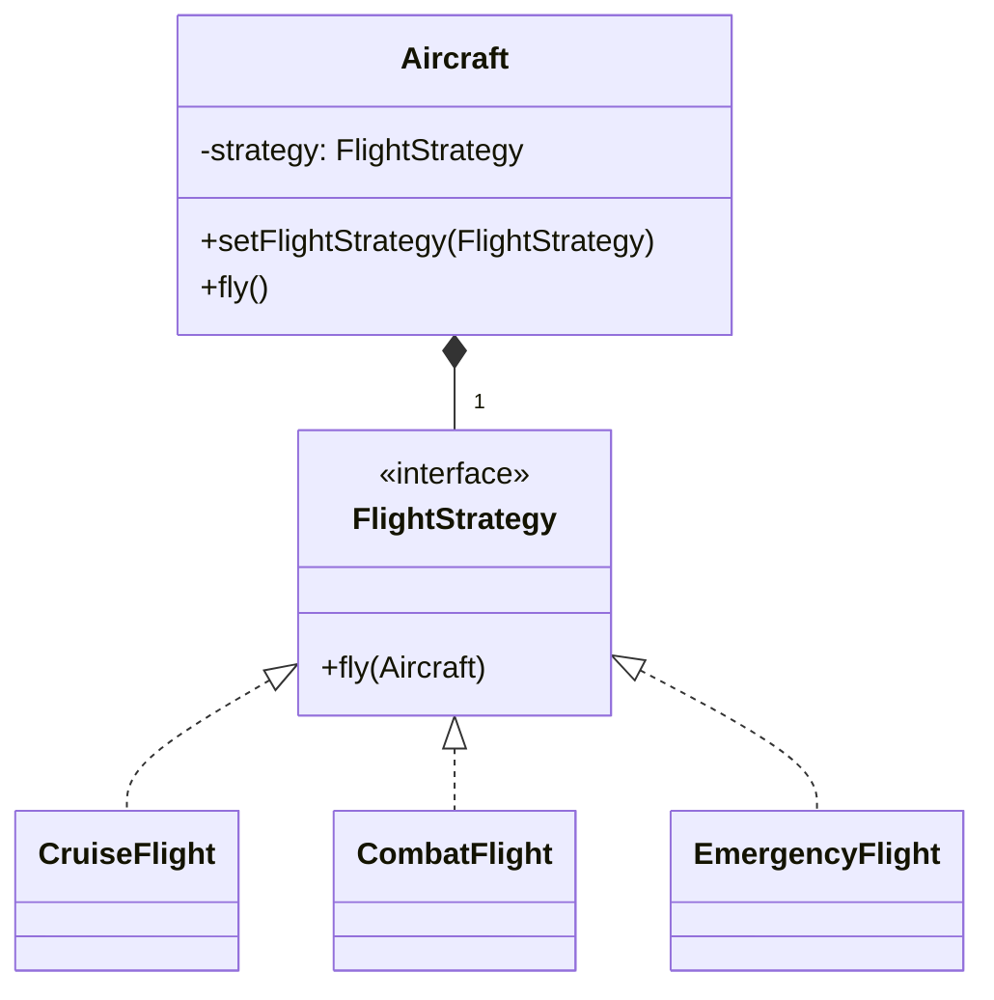

# 2018 年软件系统设计原题与答案

## 资料信息

- **原题出处**：[2015、2017、2018、2019押题、2019.pdf](<../../往年题/2015、2017、2018、2019押题、2019.pdf>)、[往年考题综合.docx](../../往年题/往年考题综合.docx)
- **现有答案来源**：[Exam0-往年考试.pdf](../../往年题/Exam0-往年考试.pdf)、[往年题整理](../../往年题整理/)
- **试卷性质**：考后回忆版；第 12 题只留下“太复杂，忘了”，无法恢复。

## 一、简答题

### 1. 什么是架构关注点（concerns）和利益相关者（stakeholders）？

**现有答案（非官方）**：利益相关者是对系统有利益或受其影响的人/组织；关注点是他们希望架构解决的问题。

**AI 校核答案**：利益相关者包括客户、最终用户、开发、测试、运维、安全人员、管理者、监管者等。关注点包括功能、成本、进度、性能、可用性、安全、可修改性、部署和维护等。同一关注点可属于多人，同一利益相关者也有多个关注点。架构师应建立“利益相关者—关注点—视图/决策”的追踪关系，避免只满足开发者视角。

### 2. 软件需求、质量属性和 ASR 有何区别与联系？

**现有答案（非官方）**：质量属性是软件需求的一部分；ASR 按“是否显著影响架构”划分，可来自功能、质量属性或约束。

**AI 校核答案**：软件需求包括功能需求、质量属性需求和约束；质量属性描述系统“做得怎样”，应以可测场景表达；ASR 是对架构有重大影响的需求集合，不是与前两者平行的需求类型。高并发性能可能是 ASR，普通界面文案通常不是；“必须接入遗留主机”虽是约束，也可能是 ASR。

资料：[软件架构简答题](../../往年题整理/01-简答题-软件架构部分.md)、[质量属性与场景](../../往年题整理/02-简答题-质量属性与场景.md)

### 3. C&C 结构的本质是什么？以 MVC 为例。

**现有答案（非官方）**：C&C 描述运行时组件及连接件；MVC 中 Model、View、Controller 是运行时角色，调用和事件通知是连接件。

**AI 校核答案**：C&C 关注系统执行时“谁在运行、如何交互”，其元素是运行时组件，关系由过程调用、消息、事件、共享数据等连接件表达。MVC 中 Controller 接收用户输入并调用 Model；Model 保存业务状态并通知 View；View 查询/观察 Model 后显示。若只画包依赖而不表达运行时交互，就不是完整的 C&C 描述。

### 4. 用质量属性场景描述可用性和可修改性

**现有答案（非官方）**：采用六要素模板。

**AI 校核答案**：可用性示例：正常运行时，数据库节点宕机；系统在 5 秒内检测并切换，未提交事务可重试，月可用性 ≥99.9%。可修改性示例：开发期新增支付渠道；修改限于支付插件和配置，不改订单核心；1 人 2 天完成，影响模块不超过 5 个。两者都必须写刺激源、刺激、环境、制品、响应和量化度量。

### 5. 什么是风险、敏感点和权衡点？举例。

**现有答案（非官方）**：风险是可能妨碍质量目标的决策；敏感点是参数的小变化会显著影响质量；权衡点同时影响多个质量属性。

**AI 校核答案**：

- **风险**：采用单实例数据库却要求极高可用性，故障会导致停机。
- **敏感点**：缓存过期时间对响应性能和数据新鲜度非常敏感。
- **权衡点**：增加加密强度提高安全性，却增加 CPU 消耗和延迟。

一个设计决策可同时是敏感点和权衡点；风险也可能因缺少分析或机制而产生。ATAM 的目的之一就是把这些关系显式化。

### 6. Module、C&C、Allocation 的问题映射与常见视图

**现有答案（非官方）**：三类分别回答代码、运行时、环境映射问题。

**AI 校核答案**：Module：Decomposition、Uses、Layered、Class；C&C：Communicating Processes、Concurrency、Shared Data、Client-Server；Allocation：Deployment、Implementation、Work Assignment、Install。判断关键是题目中的对象属于静态实现单元、运行时实体，还是机器/目录/团队等环境。

### 7. Layered 与 Multi-tier 有何区别？

**现有答案（非官方）**：Layer 是逻辑职责划分，Tier 是物理部署划分。

**AI 校核答案**：分层架构按抽象层次与职责组织模块，强调允许的依赖方向；多层部署按进程或机器位置划分系统，强调网络边界和部署。一个三层逻辑系统可以部署在同一台机器上；同一逻辑层也可跨多个 tier 部署。Layer 主要影响可修改性和理解性，Tier 还直接影响延迟、伸缩性、故障隔离和安全边界。

### 8. ADD 的过程是什么？

**现有答案（非官方）**：选择分解元素，确定驱动因素，选模式/策略，实例化并定义接口，分配职责，验证和迭代。

**AI 校核答案**：ADD 是递归、迭代的属性驱动设计方法：确认输入和 ASR；选择本轮要设计的元素；选择高优先级质量属性场景和约束；选择能满足它们的模式、策略及参考方案；实例化架构元素并分配职责、定义接口和关系；生成并更新视图；用场景验证设计、识别风险；对子元素继续迭代，直到达到足够细节。每个决策都应记录理由和权衡。

### 9. 为什么使用不同架构视图？列出四种视图。

**现有答案（非官方）**：多视图用于分离关注点并服务不同利益相关者。

**AI 校核答案**：静态代码、运行时行为与部署映射无法由一张图完整表达。可列 Decomposition（模块职责）、Uses（依赖与变更影响）、Communicating Processes（进程通信、性能/并发）和 Deployment（节点映射、容量/可用性）。还应通过跨视图映射保证一致性。

### 10. SPL 中的可变性及实现机制

**现有答案（非官方）**：变异点表示产品间可变化之处，常通过参数、配置、继承、插件或条件编译实现。

**AI 校核答案**：可变性描述产品族成员在哪些特征、质量或实现上不同。先在特征模型中记录必选、可选、替代、互斥和依赖关系，再把特征映射到架构变异点。实现机制包括参数化、配置文件、Strategy/Factory、组件替换、插件、预处理/条件编译和模型转换。应同时说明绑定时间及其对灵活性、性能和测试组合数的影响。

资料（本节 1-10）：[软件架构简答题](../../往年题整理/01-简答题-软件架构部分.md)、[架构模式与策略](../../往年题整理/03-简答题-架构模式与策略.md)

## 二、综合设计题

### 11. 飞行模拟器：使用 Strategy 设计不同飞行行为

**现有答案（非官方）**：[综合设计题整理](../../往年题整理/05-综合设计题.md)将飞机作为 Context，把飞行算法封装为 Strategy。

**AI 校核答案**：变化点是“飞行算法”，不是飞机整体，因此使用 Strategy。`Aircraft` 组合 `FlightStrategy`；客机、战斗机或不同状态可以注入不同策略；`setFlightStrategy` 支持运行时切换。这样新增算法不修改 Aircraft，符合 OCP 和 DIP。

调用时 `Aircraft.fly()` 委托给 `strategy.fly(this)`。若题目还要求按飞机类型创建默认策略，可另加 Factory；仅此题不必强行叠加模式。

资料：[综合设计题](../../往年题整理/05-综合设计题.md)、[答题模板](../../../考试重点/03-综合设计题/答题模板.md)

### 12. 复杂综合设计题（题干遗失）

**原题记录**：回忆资料仅写“太复杂，忘了”。

**答案**：题目目标、角色和约束均不可确认，无法负责任地生成答案。保留此条是为了完整反映原始回忆资料，而不是遗漏题目。

