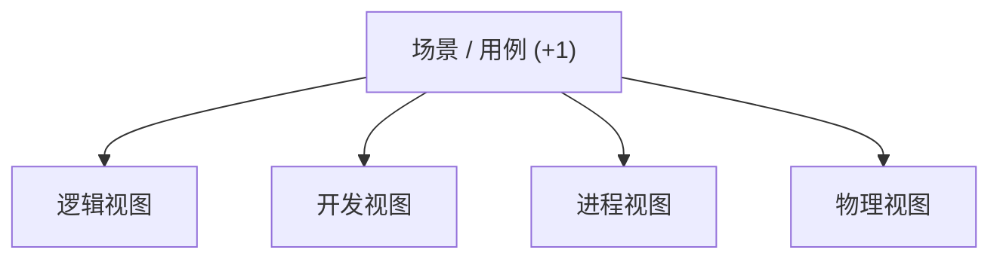
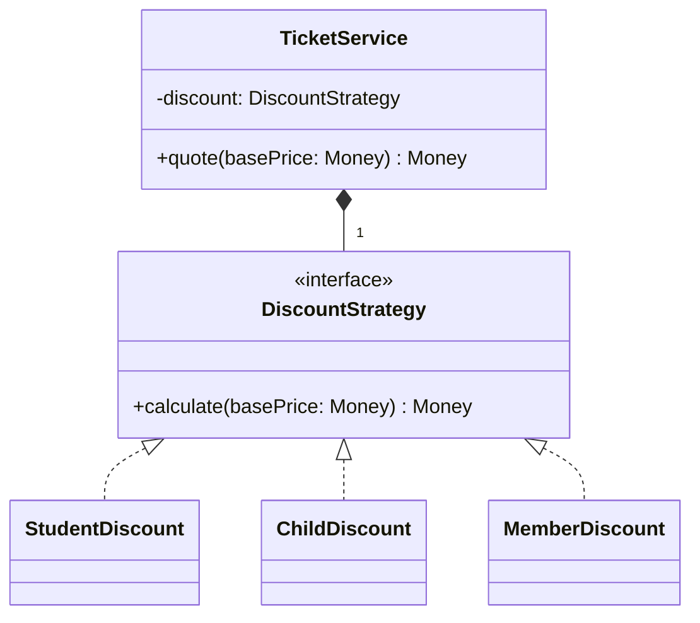
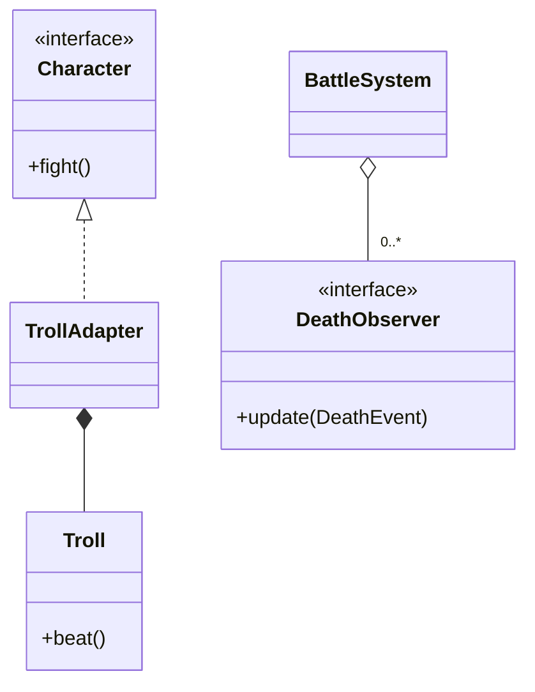

# 2019 年软件系统设计原题与答案

## 资料信息

- **原题出处**：[2015、2017、2018、2019押题、2019.pdf](<../../往年题/2015、2017、2018、2019押题、2019.pdf>)、[往年考题综合.docx](../../往年题/往年考题综合.docx)
- **补充回忆与现有答案**：[Exam0-往年考试.pdf](../../往年题/Exam0-往年考试.pdf)
- **校核资料**：[往年题整理](../../往年题整理/)
- **试卷性质**：回忆/押题整理版，无官方答案。主卷题单与补充回忆分开列出。

## 一、主要回忆题单

### 1. 用场景描述互操作性和可修改性

**现有答案（非官方）**：使用六要素质量属性场景；互操作性重点是发现、转换和正确交换信息，可修改性重点是变更范围与成本。

**AI 校核答案**：互操作性示例：正常运行时，外部医院系统以其标准消息提交患者记录；接口网关接收并转换语法与语义，核心系统成功保存并返回确认；99.9% 合法消息在 3 秒内完成，字段映射错误率低于 0.1%。可修改性示例：开发期新增一种外部消息标准；开发者只新增一个 Adapter 和映射配置，不修改核心领域代码；1 人在 3 天内完成，影响模块不超过 3 个。

资料：[质量属性与场景](../../往年题整理/02-简答题-质量属性与场景.md)

### 2. 什么是 ASR？列出四种来源/获取方法

**现有答案（非官方）**：ASR 是显著影响架构的功能、质量属性或约束。

**AI 校核答案**：可从业务目标及访谈、质量属性场景及排序、关键功能/外部接口、技术与法规约束、遗留系统和历史风险中识别。判断标准是该需求是否改变主要结构、关键技术或系统风险，而不是它是否被称为“非功能需求”。

### 3. 解释并绘制 4+1 视图

**现有答案（非官方）**：逻辑、开发、进程、物理四个视图，由场景视图贯穿。

**AI 校核答案**：逻辑视图描述领域对象及功能；开发视图描述包、模块和代码组织；进程视图描述进程/线程、通信与同步；物理视图描述部署节点和网络；场景/用例验证四个视图并连接需求与架构。

### 4. 通用架构设计策略及实例

**现有答案（非官方）**：分解、抽象、复用、间接、冗余、推迟绑定等。

**AI 校核答案**：分解将系统按职责拆分，例如分层；抽象和信息隐藏用稳定接口隔离变化，例如 Repository；间接用 Broker/Event Bus 降低耦合；冗余和复制以主备、集群提高可用性；资源管理用缓存、池化改善性能；推迟绑定用配置和插件提高可修改性。每项应同时写收益和代价。

### 5. Module、C&C、Allocation 的问题映射与视图

**现有答案（非官方）**：对应实现单元、运行时交互、环境映射。

**AI 校核答案**：Module 可列 Decomposition、Uses、Layered、Class；C&C 可列 Communicating Processes、Concurrency、Shared Data、Client-Server；Allocation 可列 Deployment、Implementation、Work Assignment、Install。静态代码问题选 Module，运行时通信选 C&C，机器/目录/团队问题选 Allocation。

### 6. 架构文档包包括什么？

**现有答案（非官方）**：视图、视图说明、跨视图信息、路线图及设计理由。

**AI 校核答案**：至少包括范围和利益相关者、视图目录、各视图的主表示/元素目录/上下文/变化指南/设计理由、跨视图映射、接口与行为说明、架构决策记录、术语表、风险及需求追踪。一组没有图例和理由的图不是完整文档包。

### 7. ATAM 各阶段有哪些利益相关者，各自职责是什么？

**现有答案（非官方）**：评价团队主持分析；项目决策者介绍业务和架构；广泛利益相关者提出并排序场景。

**AI 校核答案**：评价团队负责计划、主持、提问、记录和报告；项目决策者（客户、项目经理、架构师）提供业务驱动、架构和已有风险，并参与前期分析；利益相关者（开发、测试、运维、用户、安全等）在场景头脑风暴和投票中表达关注点，并验证结果。前一阶段参与者较少以建立上下文，后续引入更广泛人员以减少视角偏差。

### 8. SPL 的可变性与变异点

**现有答案（非官方）**：共性由核心资产实现，可变性由变异点和绑定机制实现。

**AI 校核答案**：特征模型先表达必选、可选、替代、互斥与依赖关系，再把可变特征映射到架构变异点。参数化、配置、Strategy/Factory、插件、条件编译等可实现变体；设计/编译期绑定易验证但不灵活，部署/运行期绑定灵活却增加组合测试和运行风险。

### 9. Broker 模式

**现有答案（非官方）**：Broker 协调分布式客户端和服务，提供位置透明和解耦，也增加延迟与单点风险。

**AI 校核答案**：Client 经 Client Proxy 向 Broker 发起请求，Broker 定位 Server 并通过 Server Proxy/Skeleton 转发。优点是位置透明、异构互操作、服务可替换和动态注册；缺点是间接调用开销、Broker 瓶颈/故障、调试与安全复杂。高可用场景需复制 Broker、超时重试和服务健康检查。

### 10. 微服务与 SOA 的区别

**现有答案（非官方）**：两者都面向服务和松耦合；微服务更强调小型自治服务、独立部署和去中心化治理。

**AI 校核答案**：SOA 是更广泛的企业服务集成思想，服务常较粗粒度，可能依赖 ESB、共享治理与统一数据模型；微服务把应用拆成围绕业务能力的小型自治服务，强调独立部署、独立数据所有权、轻量通信、自动化交付和故障隔离。微服务不是“更小的 SOA”这么简单，它以独立演化和组织自治换取分布式事务、观测、网络故障和运维复杂度。

资料（2-10）：[软件架构简答题](../../往年题整理/01-简答题-软件架构部分.md)、[架构模式与策略](../../往年题整理/03-简答题-架构模式与策略.md)

## 二、综合设计题

### 11. 售票折扣算法设计

**现有答案（非官方）**：[综合设计题](../../往年题整理/05-综合设计题.md)使用 Strategy，把不同折扣规则从售票上下文中分离。

**AI 校核答案**：变化点是票价计算规则。`TicketService` 依赖 `DiscountStrategy` 接口；儿童、学生、会员等规则分别实现；运行时按旅客资格或活动选择策略。若选择规则也复杂，可由 Factory/Registry 创建策略，但它不应替代 Strategy。

`quote` 委托策略计算并保证结果不小于零；资格校验应与纯价格算法分开，避免策略承担过多职责。

### 12. 与 2015 年相同的分布式缓存设计题

**现有答案（非官方）**：Observer 负责缓存更新/失效通知，Adapter 或 Bridge 统一异构远程协议。

**AI 校核答案**：缓存协调器作为 Subject，缓存节点作为 Observer；数据变更后发布带 key、版本、操作类型的事件，节点执行失效或更新。协议层定义统一 `RemoteInvoker`，由 RMI、HTTP、SOAP Adapter 实现。通知应幂等、可重试并处理乱序；节点重连时按版本补偿。完整类图和说明见 [2015 年第 12 题](../2015/原题与答案.md#12-分布式缓存系统设计) 与 [2022 年第 13 题](../2022/原题与答案.md#13-分布式缓存系统设计20-分)。

## 三、`Exam0` 中标注为 2019 的补充回忆题

以下题目未全部出现在主要年度题单中，来源置信度较低，但为避免遗漏一并收录。

### 13. 设计模式是什么？类模式与对象模式有何区别？

**现有答案（非官方）**：模式是特定上下文中反复出现问题的可复用解决方案；类模式靠继承，对象模式靠组合。

**AI 校核答案**：设计模式描述名称、问题/上下文、参与者结构、协作、结果与权衡，不是可直接复制的代码。类模式主要通过类和继承在编译期建立关系；对象模式主要通过对象组合和委托，在运行时更易替换。GoF 多数结构型/行为型模式属于对象模式。

### 14. 什么是防御式编程？断言与错误处理有何区别？

**现有答案（非官方）**：断言检查“不应发生”的程序员错误；错误处理应对可预期的运行时异常。

**AI 校核答案**：防御式编程通过输入校验、边界检查、异常处理、超时、资源清理和不变量检查限制错误传播。断言验证内部前置条件或不变量，失败通常表示程序缺陷，不能替代外部输入校验；错误处理用于网络失败、文件不存在、非法用户输入等可预期情况，应返回错误、重试、降级或记录。生产环境可能关闭断言，因此安全和业务校验必须显式执行。

### 15. MVC 中使用了哪些设计模式？

**现有答案（非官方）**：Observer、Strategy、Composite 等。

**AI 校核答案**：Model 向多个 View 发布状态变化体现 Observer；Controller 可视为对输入处理策略的封装，允许替换交互行为；复杂 View 常按 Composite 组织；View 创建也可能使用 Factory。要区分“经典 MVC 的核心协作”与某个框架的具体实现，不能断言所有 MVC 都使用全部模式。

### 16. Strategy 与 State 的异同

**现有答案（非官方）**：类图相似，意图不同。

**AI 校核答案**：二者都让 Context 组合一个抽象并委托行为。Strategy 封装可互换算法，通常由客户端配置，策略之间一般不知道彼此；State 表示对象内部状态，行为随状态改变，具体状态常触发状态迁移。判断时看“替换算法”还是“表达生命周期/状态转换”。

### 17. 迪米特法则（LoD）的应用

**现有答案（非官方）**：对象只与直接朋友通信，避免长调用链。

**AI 校核答案**：方法应主要调用自身、参数、成员、自己创建的对象及直接关联对象，避免 `a.getB().getC().doX()` 暴露内部结构。可通过 Facade、封装查询、服务方法和中介对象减少知识范围。LoD 是降低结构耦合的指导原则，不意味着所有对象都只能认识一个对象，否则会产生无意义的转发类。

### 18. 游戏角色适配与死亡通知

**重建题意**：人类角色使用 `fight()`，新增 Troll 提供 `beat()`；角色死亡时需要通知其他对象。

**现有答案（非官方）**：使用 Adapter 统一 Troll 接口，使用 Observer 发布死亡事件。

**AI 校核答案**：定义 `Character.fight()`；`TrollAdapter` 实现 Character，并在 `fight()` 中委托 `Troll.beat()`。角色或战斗系统作为 Subject，死亡监听者实现 `DeathObserver.update(event)`。Adapter 解决接口不兼容，Observer 解决一对多通知，两个模式职责不能互换。

### 19-20. 表驱动法、架构报告分析（题干不完整）

**原题记录**：`Exam0` 只留下题目主题，缺少具体数据、代码或报告材料。

**可确认知识**：表驱动法用查表代替复杂条件分支，适合规则稳定、组合多且可数据化的决策；架构报告分析应围绕业务驱动、视图、设计决策、质量属性场景、风险、敏感点和权衡点展开。由于材料缺失，无法生成针对原题的唯一答案。

资料：[设计模式简答题](../../往年题整理/04-简答题-设计模式部分.md)、[综合设计题](../../往年题整理/05-综合设计题.md)

