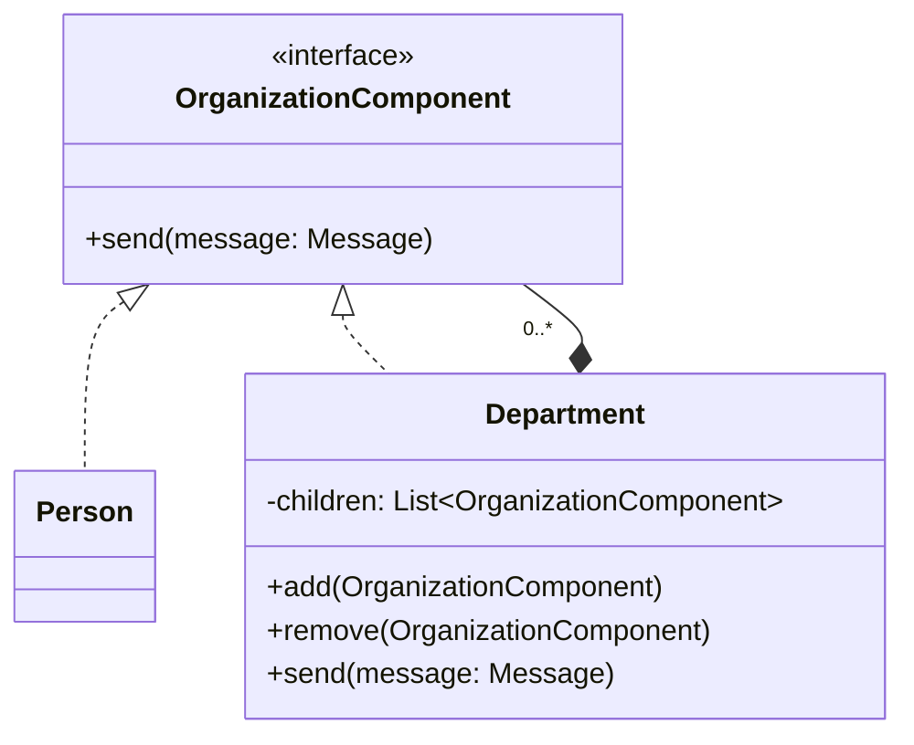
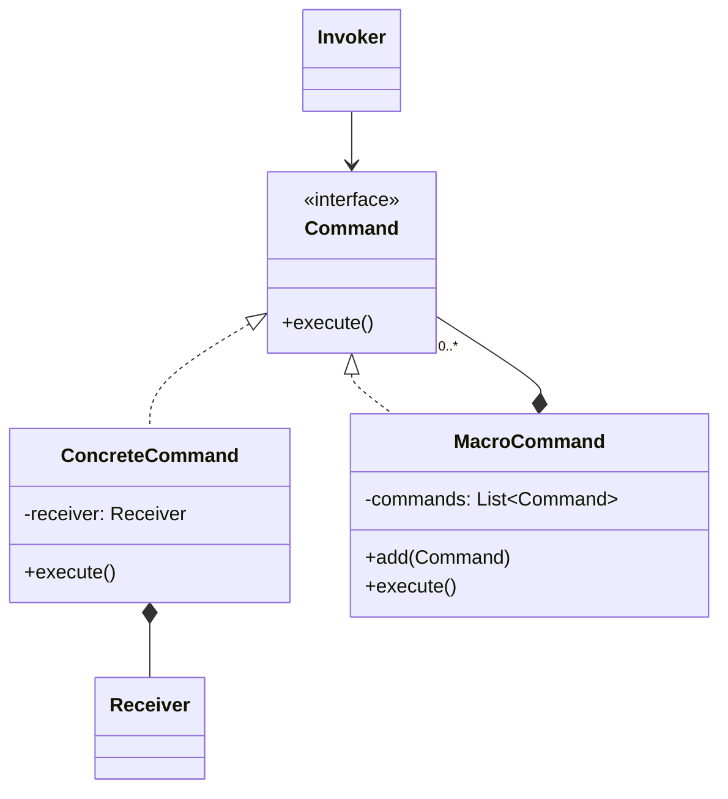
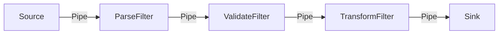
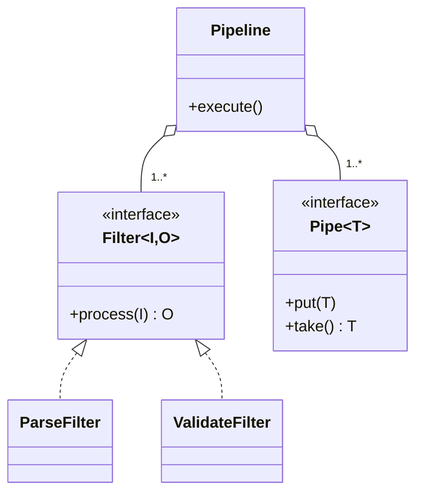

# 2021 年软件系统设计原题与答案

## 资料信息

- **原题出处**：[2021 痛苦回忆.pdf](<../../往年题/2021 痛苦回忆.pdf>)
- **现有答案来源**：[Exam0-往年考试.pdf](../../往年题/Exam0-往年考试.pdf)、[往年题整理](../../往年题整理/)
- **试卷性质**：考后回忆版，无官方答案。

## 一、简答题

### 1. 什么是软件模式？模式能否提供完整架构？

**现有答案（非官方）**：模式是特定上下文中反复出现问题的通用解决方案，单个模式通常不能给出完整架构。

**AI 校核答案**：模式说明上下文、问题、参与者、关系、协作及结果/权衡，是可复用的设计知识，不是代码模板。模式可以提供架构骨架或局部结构，但真实系统还需结合多个模式、质量属性策略、领域职责、接口、部署和具体约束，因此不能把“用了某模式”等同于“完成了架构设计”。

### 2. 为什么 Flyweight 和 Prototype 被分到不同类别？

**现有答案（非官方）**：Prototype 关注对象创建，Flyweight 关注共享对象结构。

**AI 校核答案**：GoF 按主要意图分类。Prototype 通过复制原型创建对象，解决“如何创建、避免依赖具体类”，属于创建型；Flyweight 把可共享的内部状态与外部状态分离，大量复用细粒度对象以节省内存，属于结构型。两者都可能涉及复制/共享，但分类看核心问题，而不是实现中用了什么语法。

### 3. 什么是依赖倒置原则？设计模式如何体现？

**现有答案（非官方）**：高层和低层都依赖抽象，抽象不依赖细节。

**AI 校核答案**：DIP 要求高层策略与低层细节均依赖稳定抽象，细节实现抽象。Strategy 中 Context 依赖 Strategy 接口；Observer 中 Subject 依赖 Observer 接口；Command 中 Invoker 依赖 Command 接口；Factory Method 让创建逻辑依赖抽象产品。DIP 的目的不是消除依赖，而是让依赖方向指向较稳定的抽象。

### 4. Command 模式适用于什么情况？

**现有答案（非官方）**：请求参数化、排队/日志、撤销重做、宏命令和解耦请求发出者与执行者。

**AI 校核答案**：当请求需要作为对象被保存、传递、组合或延迟执行时使用 Command。典型场景包括菜单/按钮参数化、任务队列、事务日志、撤销重做、宏命令和远程请求。代价是命令类数量增加；若请求只是一行稳定调用且无需生命周期管理，直接调用更简单。

### 5. Barricade 与 Assertion 的目的是什么？

**现有答案（非官方）**：Barricade 隔离不可信数据，Assertion 检查内部不变量和程序员错误。

**AI 校核答案**：Barricade 在外部世界与可信核心之间建立边界，在入口处完成校验、清洗、转换和错误报告，使内部代码可基于更强前提工作。Assertion 用来声明本应成立的前置条件、后置条件或不变量，失败表示程序缺陷。外部输入、权限和业务规则不能只靠断言，因为断言可能被关闭且不适合恢复型错误处理。

### 6. 哪些需求对架构重要？在哪里描述？

**现有答案（非官方）**：ASR 对主要结构、技术选择或风险有显著影响，常通过质量属性场景、约束和架构驱动因素记录。

**AI 校核答案**：关键业务功能、高优先级质量属性、外部接口、法规/技术/部署约束都可能成为 ASR。它们先在需求规格、用例、质量属性场景和约束清单中描述，再在架构文档的驱动因素、视图、接口和架构决策记录中建立追踪。不能只写在某张架构图里。

### 7. 为什么设计决策重要？如何理解“架构 = 设计 + 设计决策”？

**现有答案（非官方）**：结构图说明系统是什么，设计决策说明为什么这样以及受什么约束。

**AI 校核答案**：相同结构可能源于不同质量目标，后续修改是否允许也取决于决策理由。设计决策应记录问题、上下文、候选方案、选择、理由、权衡、状态和后果。C&C 等视图展示元素及关系，决策记录补充选择这些元素和关系的原因、未采用方案及演化规则，两者合起来才足以支持理解、评价和维护。

### 8. 通用架构设计策略有哪些？在 ADD 中如何使用？

**现有答案（非官方）**：分解、抽象、复用、间接、冗余、推迟绑定等；ADD 按驱动因素选择模式和策略并迭代验证。

**AI 校核答案**：ADD 先选当前元素和高优先级 ASR，再选择对应策略：性能可用并发、缓存和资源池；可用性可用监测、冗余、恢复；可修改性可用分解、信息隐藏、中介与推迟绑定。随后实例化元素、分配职责、定义接口、更新视图，并用场景验证收益和代价。策略必须由 ASR 驱动，不能先套模式再寻找理由。

### 9. C&C 的本质是什么？以 SOA 为例。

**现有答案（非官方）**：C&C 描述运行时组件和连接件；SOA 的组件是服务，连接件是消息/请求协议等。

**AI 校核答案**：C&C 展示系统执行时的实体、交互机制与拓扑。SOA 中 Service、Consumer、Registry/ESB 可作为运行时组件，SOAP/REST 消息、事件总线和服务调用是连接件；契约约束消息格式和行为。仅画“订单模块依赖支付模块”的静态包图不能表达超时、异步消息、并发和故障传播。

### 10. ATAM 各阶段输出

**现有答案（非官方）**：业务驱动、架构表示、效用树、场景排序、风险/非风险、敏感点、权衡点和风险主题。

**AI 校核答案**：陈述阶段输出业务驱动和架构描述；调查阶段输出效用树及高优先级场景分析；测试阶段输出利益相关者场景、投票排序和更新分析；报告阶段输出风险、非风险、敏感点、权衡点、风险主题和建议。ATAM 结论应能追踪到具体场景和架构决策。

资料（简答题）：[软件架构简答题](../../往年题整理/01-简答题-软件架构部分.md)、[设计模式简答题](../../往年题整理/04-简答题-设计模式部分.md)

## 二、综合设计题

### 11. 高校组织树：向学院/部门或个人发送消息

**现有答案（非官方）**：[综合设计题](../../往年题整理/05-综合设计题.md)使用 Composite，使部门与个人具有统一发送接口。

**AI 校核答案**：组织是树形“部分—整体”结构。抽象 `OrganizationComponent.send(message)`；`Person` 为叶子，向个人发送；`Department` 为组合，保存子部门和人员并递归转发。这样客户端可统一处理个人和部门。若消息真正由外部事件自动广播，才另加 Observer；本题仅要求树上发送，Composite 足够。



### 12. MacroCommand 代码设计

**现有答案（非官方）**：Command + Composite；宏命令实现 Command 并组合多个子命令。

**AI 校核答案**：`Invoker` 只依赖 `Command.execute()`；具体命令保存 Receiver，并在执行时调用 Receiver；`MacroCommand` 同样实现 Command，内部顺序执行子命令。若要求撤销，可逆命令还需 `undo()`，宏命令按相反顺序撤销。



```java
interface Command { void execute(); }

final class MacroCommand implements Command {
    private final List<Command> commands = new ArrayList<>();
    void add(Command command) { commands.add(command); }
    public void execute() {
        for (Command command : commands) command.execute();
    }
}
```

### 13. Pipe-and-Filter：C&C 图、类图、Java 类及映射

**现有答案（非官方）**：运行时数据通过 Pipe 在 Filter 间流动；实现中 Filter 接口对应过滤器角色，Pipe 对应队列/流。

**AI 校核答案**：每个 Filter 独立转换输入并产生输出，不应知道整条流水线；Pipe 传输数据并可提供缓冲。适用于编译、ETL、流处理。优点是复用、组合和并发，代价是数据格式转换、错误处理和端到端状态管理较复杂。





```java
interface Filter<I, O> { O process(I input); }

final class Pipeline<A, B, C> {
    private final Filter<A, B> first;
    private final Filter<B, C> second;
    Pipeline(Filter<A, B> first, Filter<B, C> second) {
        this.first = first;
        this.second = second;
    }
    C execute(A input) { return second.process(first.process(input)); }
}
```

**映射**：C&C 中的运行时 Filter 映射为实现 `Filter` 的对象/线程；Pipe 映射为方法参数（同步流水线）或阻塞队列/流（异步流水线）；Pipeline 负责装配拓扑，不承载具体转换算法。

资料：[架构模式与策略](../../往年题整理/03-简答题-架构模式与策略.md)、[综合设计题](../../往年题整理/05-综合设计题.md)、[答题模板](../../../考试重点/03-综合设计题/答题模板.md)

