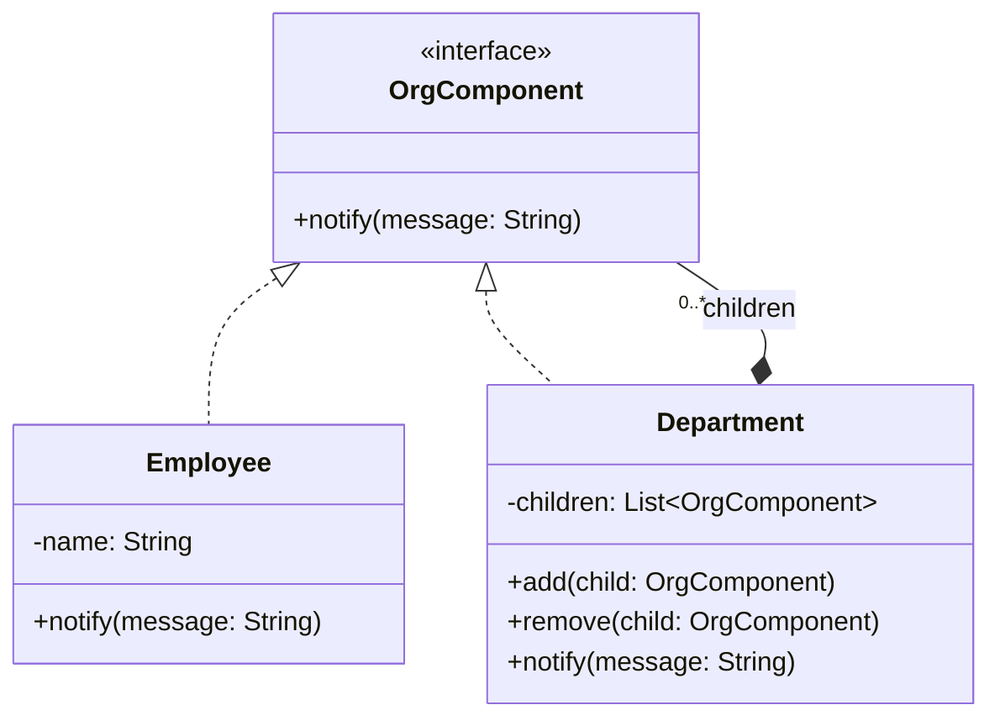
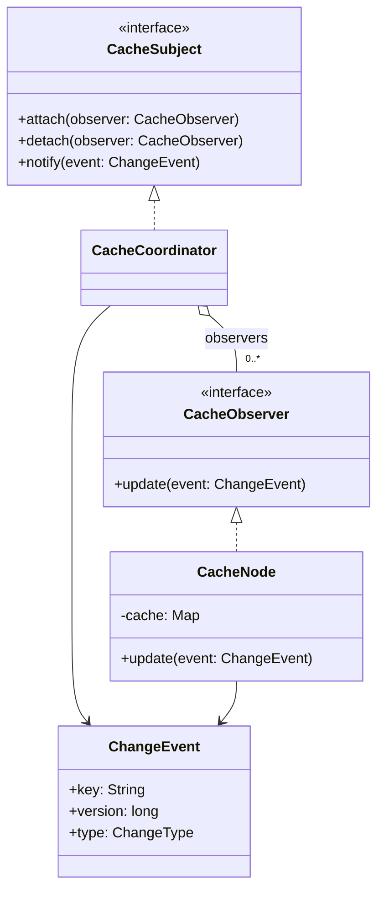
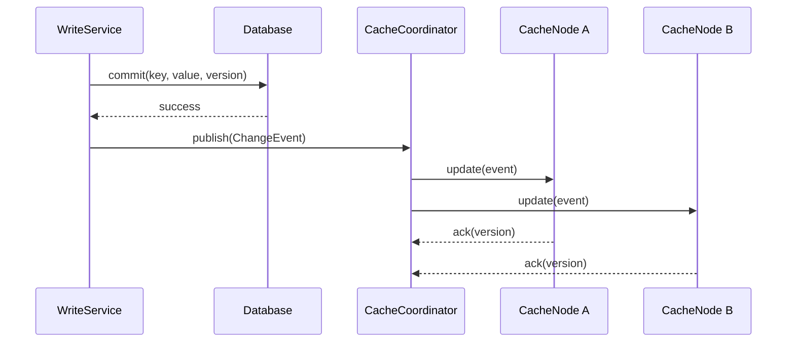
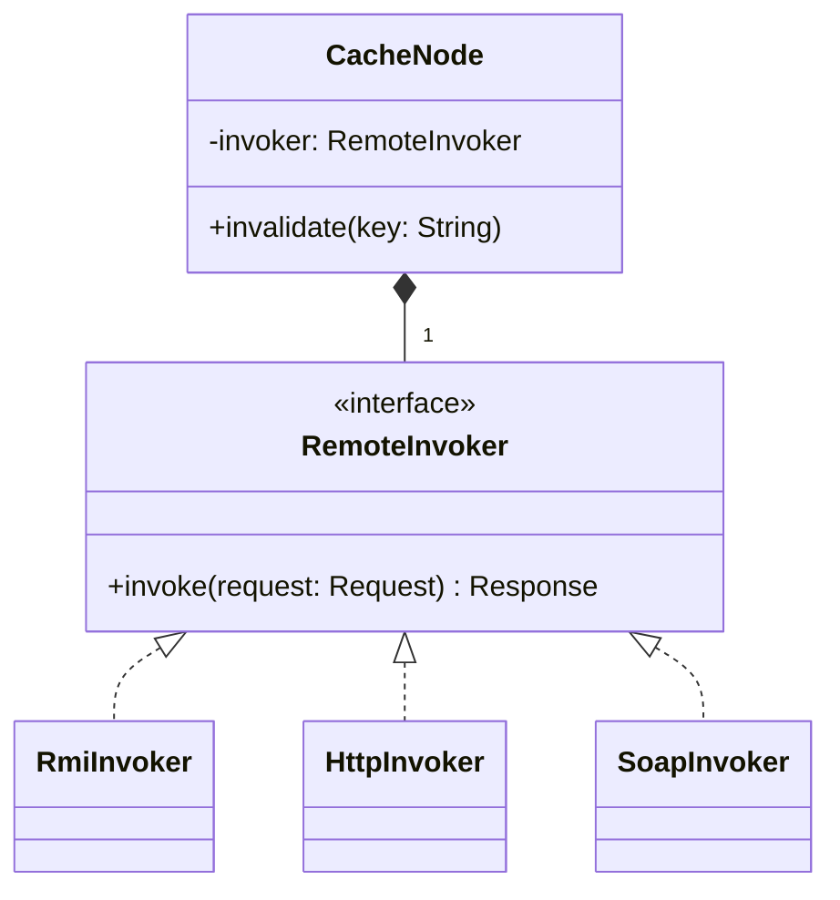

# 2022 年软件系统设计 A 卷原题与答案

## 资料信息

- **原题出处**：[软统2022试卷.pdf](../../往年题/软统2022试卷.pdf)
- **现有答案来源**：[Exam0-往年考试.pdf](../../往年题/Exam0-往年考试.pdf)、[往年题整理](../../往年题整理/)
- **试卷性质**：正式 A 卷；仓库中未发现教师官方答案。

## 一、简答题

### 1. LSP 是什么？它如何促进 OCP？

**现有答案（非官方）**：子类型应能替换父类型而不破坏正确性；满足 LSP 才能通过增加子类型扩展而不修改客户端。

**AI 校核答案**：LSP 要求使用基类型的程序在替换为其子类型后仍保持可观察行为正确。子类型不能强化前置条件、削弱后置条件或破坏不变量，也不应改变客户端依赖的异常和语义。OCP 依赖稳定抽象来扩展；若新增子类满足 LSP，客户端无需类型判断或修改原逻辑即可接受新实现，因此“对子类型扩展开放、对客户端修改关闭”。继承语法本身不保证 LSP。

### 2. Factory Method 和 Abstract Factory 如何遵循 OCP？

**现有答案（非官方）**：客户端依赖抽象产品，创建被封装；新增产品通过增加具体工厂/产品实现。

**AI 校核答案**：Factory Method 由 Creator 声明返回抽象 Product 的工厂方法，子类决定实例化哪种 ConcreteProduct；Abstract Factory 提供创建一族相关抽象产品的接口，ConcreteFactory 创建匹配的产品族。业务代码只依赖抽象工厂/抽象产品，替换产品族或新增具体实现通常无需修改客户端。但 Abstract Factory 若增加一种“产品类型”，必须修改工厂接口及所有具体工厂，因此它对“新增产品族”开放，对“新增产品等级结构”并不完全开放。

### 3. Command 中解耦 Receiver 与 Invoker 有什么好处？

**现有答案（非官方）**：Invoker 不知道执行细节，可参数化、排队、记录、撤销和组合请求。

**AI 校核答案**：Invoker 只依赖 `Command.execute()`，不知道 Receiver 类型和调用步骤；命令对象封装 Receiver、参数和操作。由此可在不修改 Invoker 的情况下替换请求，支持队列、延迟执行、日志、重试、宏命令和撤销。代价是类和对象数量增加；命令若持有过期 Receiver 或状态，还需管理生命周期。

### 4. Observer 的 push 与 pull 模型有什么权衡？

**现有答案（非官方）**：push 由 Subject 直接发送数据，简单但可能过量；pull 只通知变化，Observer 再查询，灵活但增加查询和耦合。

**AI 校核答案**：Push 在通知中携带完整或足够状态，Observer 响应快、调用少，但不同 Observer 需求不同会导致数据冗余和通知接口不稳定。Pull 只传主体引用或事件标识，Observer 按需读取，接口较稳定且数据按需，但可能产生多次查询、竞态和 Observer 对 Subject 查询接口的耦合。实践中常用混合方式：事件携带 key、版本和最小快照，需要更多信息时再拉取。

### 5. 创建型与结构型模式有何区别？为什么 Prototype 与 Flyweight 分属两类？

**现有答案（非官方）**：创建型关注对象创建，结构型关注类/对象组合；Prototype 复制创建，Flyweight 共享结构。

**AI 校核答案**：创建型模式隐藏或灵活化实例化过程；结构型模式组织类与对象形成更大结构。Prototype 的意图是通过克隆已有实例创建新对象，避免依赖具体类；Flyweight 的意图是分离内部/外部状态并共享大量细粒度对象以节省资源。分类依据主要意图，不取决于模式实现中是否也发生了创建。

### 6. 软件需求、质量属性和 ASR 的区别与联系

**现有答案（非官方）**：软件需求包括功能、质量和约束；ASR 是其中显著影响架构的子集。

**AI 校核答案**：功能需求说明系统做什么；质量属性说明系统在特定刺激和环境下做得怎样；约束限制技术或方案选择。ASR 按“架构影响”划分，可来自上述任何类型。例如“完成普通资料查询”是功能需求，但未必是 ASR；“在断网环境下继续交易并最终同步”同时涉及关键功能、可用性和一致性，通常是 ASR。

### 7. 什么是 Availability？MTBF、MTTR 及计算公式是什么？

**现有答案（非官方）**：可用性是系统可提供正确服务的时间比例，`A = MTBF / (MTBF + MTTR)`。

**AI 校核答案**：Availability 表示系统在需要时处于可操作并正确提供服务状态的概率或时间比例。MTBF 是平均无故障运行时间，MTTR 是平均修复/恢复时间。稳态近似：

`Availability = MTBF / (MTBF + MTTR)`

例如 MTBF=1000 小时、MTTR=1 小时，可用性约为 99.9001%。提升可用性既可延长 MTBF（预防故障），也可缩短 MTTR（检测、切换、恢复）。需区分 availability 与 reliability：前者允许快速恢复，后者关注一段时间内不发生故障。

### 8. 通用设计策略及实例

**现有答案（非官方）**：分解、抽象、复用、间接、冗余、推迟绑定等。

**AI 校核答案**：按职责分解可降低复杂度；抽象和信息隐藏隔离变化；中介（Facade、Broker、Event Bus）减少直接依赖；冗余、复制和健康检查提高可用性；并发、缓存与资源池改善性能；认证、授权和限制暴露面提高安全性；配置、插件和依赖注入推迟绑定以改善可修改性。必须说明策略的质量目标和代价。

### 9. 为什么使用多个架构视图？举四种并说明用途。

**现有答案（非官方）**：多个视图分离静态、运行时和部署关注点，服务不同利益相关者。

**AI 校核答案**：可答 Decomposition（模块职责和工作分配）、Uses（依赖与增量开发）、Communicating Processes（运行时交互、并发和性能）、Deployment（节点映射、容量和可用性）。每个视图只强调一组关注点，跨视图映射负责说明模块怎样实例化为运行时组件并部署到节点。

### 10. 风险、敏感点和权衡点是什么？举例。

**现有答案（非官方）**：风险威胁质量目标；敏感点对参数变化敏感；权衡点影响多个质量属性。

**AI 校核答案**：无冗余数据库承载高可用业务是风险；线程池大小对吞吐和响应时间显著敏感，是敏感点；提高加密强度改善安全性却降低性能，是权衡点。三者不是互斥分类：一个敏感决策也可能形成权衡，若未经合理控制便成为风险。

资料（简答题）：[软件架构简答题](../../往年题整理/01-简答题-软件架构部分.md)、[质量属性与场景](../../往年题整理/02-简答题-质量属性与场景.md)、[设计模式简答题](../../往年题整理/04-简答题-设计模式部分.md)

## 二、综合设计题

### 11. 最多创建 n 个实例的 Multi-instance（10 分）

**现有答案（非官方）**：用受控实例池代替普通构造；私有构造函数，静态方法循环返回最多 n 个实例。

**AI 校核答案**：这是 Singleton 的受限变体（Multiton/Instance Pool）。关键不只是 `% n`，还应保证构造受控、并发安全、`n > 0` 且实例数确实不超过 n。

```java
public final class MultiInstance {
    private static final int MAX = 3;
    private static final MultiInstance[] INSTANCES = new MultiInstance[MAX];
    private static int next;

    private MultiInstance() {}

    public static synchronized MultiInstance getInstance() {
        int index = next++ % MAX;
        if (INSTANCES[index] == null) {
            INSTANCES[index] = new MultiInstance();
        }
        return INSTANCES[index];
    }
}
```

若 `n` 由运行时首次配置，可在初始化阶段固定池大小；初始化后再改变 `n` 会使实例身份和线程安全语义混乱。真实资源池通常还需要借出/归还和占用状态，本题只要求实例上限，轮询返回即可。

### 12. OA 组织树：向部门、全体或个人发送通知（10 分）

**现有答案（非官方）**：[综合设计题](../../往年题整理/05-综合设计题.md)判断为 Composite；部门组合子部门/员工，统一 `notify` 接口。

**AI 校核答案**：题目核心是树形部分—整体以及对叶子/组合统一操作，首选 Composite。不要因出现“通知”一词就误选 Observer；题目没有“状态变化后自动通知订阅者”的要求。



```java
interface OrgComponent { void notify(String message); }

final class Employee implements OrgComponent {
    private final String name;
    Employee(String name) { this.name = name; }
    public void notify(String message) { System.out.println(name + ": " + message); }
}

final class Department implements OrgComponent {
    private final List<OrgComponent> children = new ArrayList<>();
    void add(OrgComponent child) { children.add(child); }
    void remove(OrgComponent child) { children.remove(child); }
    public void notify(String message) {
        for (OrgComponent child : children) child.notify(message);
    }
}
```

通知某个人就调用 Employee；通知某部门就调用该 Department；通知全体就调用根 Department。组合关系画在 Department 与 `0..* OrgComponent` 之间，继承/实现箭头指向抽象组件。

### 13. 分布式缓存系统设计（20 分）

#### 13.1 需要增加哪些组件？

**现有答案（非官方）**：缓存更新协调/发布组件、缓存节点观察者、协议适配或 Web Service 连接件。

**AI 校核答案**：至少增加：缓存协调器/事件发布者；缓存节点监听器；订阅注册表；变更事件（key、版本、操作类型）；重试或持久事件队列；统一远程调用接口及 RMI、HTTP/JSP、SOAP 适配器。若题目只要求基本结构，前四项即可；可靠性组件是合理加分项。

#### 13.2 Observer 角色映射

- `Subject`：`CacheCoordinator`，维护订阅者并发布数据变更。
- `Observer`：`CacheObserver` 接口，声明 `update(ChangeEvent)`。
- `ConcreteObserver`：各 `CacheNode`，收到事件后更新或失效本地缓存。
- 业务数据源/写服务：变更成功后触发协调器，避免先通知后提交造成脏状态。



#### 13.3 更新时序



先提交权威数据再通知。通知可采用失效而非直接推送完整值；节点按版本处理，消息重复时保持幂等，失败时重试或从持久日志补偿。

#### 13.4 如何支持 RMI、JSP/HTTP、SOAP 等异构缓存协议？

**现有答案（非官方）**：提供统一连接件/服务接口，用 Adapter 屏蔽不同协议；若抽象和协议均独立变化可用 Bridge。

**AI 校核答案**：定义稳定的 `RemoteInvoker.invoke(Request)`；每种协议实现一个 Adapter，把统一请求转为 RMI 调用、HTTP 请求或 SOAP 消息。缓存节点只依赖该接口，通过 Factory/配置选择实现。此方案符合 DIP 和 OCP。若缓存操作（get/put/invalidate）和协议实现都需要独立扩展，可进一步用 Bridge 把操作抽象与传输实现分成两维。



资料（综合题）：[综合设计题](../../往年题整理/05-综合设计题.md)、[答题模板](../../../考试重点/03-综合设计题/答题模板.md)、[设计模式目录](../../../考试重点/02-设计模式/README.md)

