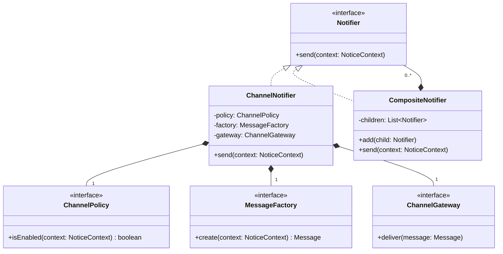
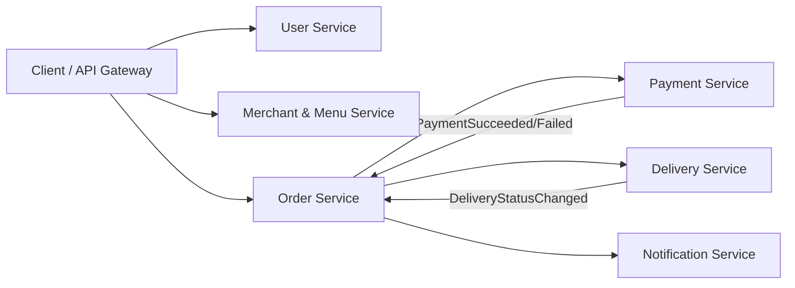

# 2025 年软件系统设计原题与答案

## 资料信息

- **原题出处**：[软统25期末-不完全准确.jpeg](../../往年题/软统25期末-不完全准确.jpeg)
- **现有答案来源**：[往年题整理](../../往年题整理/)、[考试重点](../../../考试重点/考试重点.md)
- **试卷性质**：考后不完全回忆，题目措辞可能存在偏差；仓库中未发现独立原答案或官方答案。

## 一、简答题

### 1. 什么需求影响架构？如何获得这些需求？

**现有答案（非官方）**：影响主要结构、技术选择和风险的 ASR；从业务目标、质量属性、约束、核心功能和利益相关者中获取。

**AI 校核答案**：关键业务功能、高优先级质量属性、外部系统接口、法规/技术/部署约束均可能影响架构。可通过利益相关者访谈、业务目标分析、质量属性场景工作坊、用例与接口审查、遗留系统分析、原型/风险实验和场景优先级排序获得。判断 ASR 的标准是若忽略它，是否会显著改变架构或造成高风险，而不是简单把所有“非功能需求”都列为 ASR。

### 2. 如何描述质量属性场景？描述互操作性和性能

> 回忆图中的属性名称略模糊；既有整理按“互操作性 + 性能”解释。本答案沿用该口径。

**现有答案（非官方）**：使用刺激源、刺激、环境、制品、响应、响应度量六要素。

**AI 校核答案**：互操作性示例：正常运行时，合作方系统按其消息标准提交订单；集成网关接收并转换语法/语义，订单服务正确处理并返回确认；99.9% 合法消息在 3 秒内完成，字段映射错误率 <0.1%。性能示例：促销高峰期，2000 并发用户持续查询；查询服务返回结果；95% 响应 <2 秒、吞吐 ≥800 req/s、错误率 <0.1%。必须量化响应，否则不是可评价场景。

### 3. C&C 风格的性质是什么？以 SOA 为例

**现有答案（非官方）**：C&C 描述运行时组件、连接件及拓扑；SOA 中服务是组件，消息/服务调用是连接件。

**AI 校核答案**：C&C 的元素在运行时存在并执行，连接件承载调用、消息、事件或数据流，配置描述拓扑和约束。SOA 中 Service、Consumer、Registry/ESB 是组件；REST/SOAP 调用、消息总线是连接件；服务契约约束接口和消息。由此可以分析延迟、吞吐、并发、故障传播和运行时可用性。

### 4. ADD 3.0 的过程

**现有答案（非官方）**：识别输入和驱动因素，选择迭代目标，选设计概念，实例化元素，分析并记录，再迭代。

**AI 校核答案**：ADD 3.0 可按七步表述：检查输入是否充分；建立迭代目标并选择要设计的系统部分；选择本轮架构驱动因素；选择满足驱动因素的设计概念（模式、策略、参考架构、技术）；实例化架构元素、分配职责并定义接口；绘制/更新视图并记录决策；分析当前设计、检查目标是否满足并规划下一轮。全过程以风险和 ASR 优先，允许不同轮次分别细化结构、部署和关键质量属性。

### 5. 微服务的主要特征

**现有答案（非官方）**：围绕业务能力、小型自治、独立部署、去中心化数据与治理、自动化和容错。

**AI 校核答案**：服务围绕业务能力和 bounded context 划分；每个服务可独立开发、部署、扩缩容和演化；服务拥有自己的数据和明确 API；轻量通信并避免共享实现；团队端到端负责构建与运行；通过自动化测试、持续交付、可观测性和故障隔离支撑分布式运行。代价包括网络故障、数据一致性、跨服务事务、运维和调试复杂度，不能把“拆成很多小 REST 接口”直接等同于微服务。

### 6. Factory Method 与 Abstract Factory 属于哪类？如何体现 OCP？

**现有答案（非官方）**：均属于创建型模式，通过依赖抽象产品并扩展具体工厂/产品减少客户端修改。

**AI 校核答案**：Factory Method 由子类决定一种产品的创建；Abstract Factory 创建一族相互匹配的产品。新增具体产品实现或产品族时，客户端仍依赖抽象，符合 OCP。限制是 Abstract Factory 对新增“产品种类”不友好，因为工厂接口和全部具体工厂都要增加方法，应在答案中说明这一权衡。

### 7. Notifier 与 EmailNotifier 的继承是否符合面向对象/OCP 原则？

> 回忆资料没有保留两个类的完整接口和行为，无法对具体代码作唯一判断。

**现有答案（非官方）**：应重点检查 EmailNotifier 能否替换 Notifier，以及新增通知方式是否需要修改既有调用方。

**AI 校核答案**：若 `Notifier` 是抽象通知契约，`EmailNotifier` 保持相同前置/后置条件且客户端只依赖 `Notifier`，那么继承满足 LSP/DIP；新增 `SmsNotifier` 只增加实现，通常也符合 OCP。若 `Notifier` 本身代表某个具体渠道，或子类通过拒绝合法输入、抛出额外异常、改变通知语义来实现 Email，则只是“为了复用代码而继承”，可能违反 LSP。更稳妥的设计是稳定 `Notifier` 接口，具体渠道分别实现，并用组合复用编码、重试等公共策略。

### 8. Command 的主要角色；Invoker 能否删除？

**现有答案（非官方）**：角色包括 Command、ConcreteCommand、Receiver、Invoker、Client；某些简单场景可由 Client 直接执行命令，但会失去独立请求触发者。

**AI 校核答案**：Command 定义执行接口；ConcreteCommand 保存 Receiver 和参数；Receiver 完成真正业务；Invoker 在适当时机触发命令；Client 创建并装配对象。Invoker 不是语法上不可缺少：队列、框架或客户端都可直接调用 Command。但若题目需要按钮/遥控器、调度、历史记录、排队或宏操作，Invoker 承担稳定的触发与生命周期职责，删除它会把职责泄漏给 Client。因此应回答“可合并，但取决于是否仍有独立触发职责”，而非绝对能/不能。

### 9. Java `notifyObservers` 为什么有两个重载版本？

**现有答案（非官方）**：一个不带参数，只表示发生变化；一个携带额外信息，分别支持 pull 与 push/混合通知。

**AI 校核答案**：经典 `Observable.notifyObservers()` 通知观察者后由其查询 Subject，偏 pull；`notifyObservers(Object arg)` 同时传递事件或变化摘要，支持 push 或混合方式。重载让 Subject 在不改变 Observer 基本更新入口的情况下选择通知粒度。需注意现代 Java 已弃用 `Observable/Observer`，但该题考查的是模式语义和 push/pull 权衡。

### 10. Facade 体现什么原则？与 Proxy 有何区别？举例。

**现有答案（非官方）**：Facade 提供简化统一入口，体现最少知识和降低耦合；Proxy 保持与真实对象相同接口并控制访问。

**AI 校核答案**：Facade 为复杂子系统提供较高层、较简单的接口，减少客户端知道的对象，体现封装、最少知识原则和依赖稳定边界。例如 `HomeTheaterFacade.watchMovie()` 协调投影、音响和播放器。Proxy 与 RealSubject 实现相同接口，客户端意图仍是访问真实对象，代理负责访问控制、懒加载、远程调用或缓存，例如图片懒加载代理。Facade 主要“简化子系统”，Proxy 主要“控制对一个对象的访问”。

资料（简答题）：[软件架构简答题](../../往年题整理/01-简答题-软件架构部分.md)、[质量属性与场景](../../往年题整理/02-简答题-质量属性与场景.md)、[设计模式简答题](../../往年题整理/04-简答题-设计模式部分.md)

## 二、综合设计题

### 11. 多渠道通知：渠道需满足运行时条件，且避免创建未使用的信息

**题意整理**：系统有多个通知渠道；每个渠道只有满足运行时条件才参与发送；消息内容创建可能昂贵，不应为未启用渠道提前创建。

**现有答案（非官方）**：[综合设计题](../../往年题整理/05-综合设计题.md)推荐 Factory Method + Composite + Strategy。仓库未发现该题的独立原答案。

**AI 校核答案**

- **Strategy**：`ChannelPolicy` 判断某渠道在当前 Context 下是否可用，把运行时选择规则从发送器中分离。
- **Composite**：`CompositeNotifier` 组合多个 `Notifier`，客户端把单渠道和渠道组统一看待。
- **Factory Method/Factory**：仅在策略通过后，用 `MessageFactory.create(channel, context)` 延迟创建该渠道所需消息，避免无用构造。

若题目要求“订阅者随事件自动收到通知”，可再使用 Observer；现有题意只要求渠道组合和条件发送，不必强加 Observer。

关键流程：Composite 遍历子通知器；ChannelNotifier 先执行 `policy.isEnabled(context)`；仅返回 true 时才调用 Factory 创建消息并交给 Gateway。这样模式不是堆砌：Composite 管整体层次，Strategy 管选择变化，Factory 管延迟创建。

### 12. 外卖平台为什么使用微服务？划分服务并映射三个操作

**现有答案（非官方）**：按业务能力划分用户、商家、菜单、订单、支付、配送、通知等服务，并说明各操作的调用链。仓库未发现独立原答案。

**AI 校核答案**

**采用原因**：订单、支付、配送等业务变化速度和负载特征不同，需要独立部署/扩缩容；故障隔离可避免推荐或通知故障拖垮下单；团队可围绕业务能力自治。但若规模很小，模块化单体成本更低，微服务并非天然正确。

**服务边界**：

- `User Service`：用户、地址和偏好。
- `Merchant/Menu Service`：商家营业状态、菜品、库存与价格。
- `Order Service`：订单生命周期和订单快照。
- `Payment Service`：支付、退款和对账。
- `Delivery Service`：骑手、派单、轨迹和送达。
- `Notification Service`：短信、Push、站内消息。

**操作映射示例**：

1. **浏览/选餐**：Gateway 查询 User 地址，再查询 Merchant/Menu 的可配送商家、菜单、库存和价格；只读路径可缓存。
2. **提交并支付订单**：Order 获取菜单价格快照并创建待支付订单；调用 Payment；支付结果以幂等事件返回，成功后确认订单，失败则关闭。不要跨服务共享数据库事务，可用 Saga/补偿处理。
3. **配送与状态查询**：Order 发布已支付事件；Delivery 创建配送单并派单；配送状态事件更新订单投影视图并由 Notification 通知用户。查询可使用聚合 API 或读模型，避免客户端自行拼接不一致状态。

每个服务拥有自己的数据，通过 API/事件交换，不直接读写其他服务数据库。答案应同时覆盖服务边界、操作调用链、数据所有权、故障/一致性策略，不能只列服务名称。

资料：[架构模式与策略](../../往年题整理/03-简答题-架构模式与策略.md)、[综合设计题](../../往年题整理/05-综合设计题.md)、[答题模板](../../../考试重点/03-综合设计题/答题模板.md)
