# 综合设计题

> 本文按照[综合设计题答题模板](../../考试重点/03-综合设计题/答题模板.md)整理，并重新核对了真题原文与模式语义。
>
> - 单一模式题采用 **4.4 设计模式题模板**。
> - 多模式题采用 **4.5 多模式联合使用模板**。
> - 类关系使用 Mermaid `classDiagram` 表示；运行时架构和交互分别使用 `flowchart`、`sequenceDiagram`。
> - 答案是符合题意的参考设计，不代表唯一实现；不为了套模板而强行增加模式。

## 正确性审计结论

| 题目 | 主模式/架构 | 审计结论 |
|---|---|---|
| 1 飞行模拟 | Strategy | 题目明确指定，正确 |
| 2 票价折扣 | Strategy | 题目明确指定，正确 |
| 3 游戏角色 | Adapter + Observer | `beat()` 接口适配 + 死亡通知；武器未要求动态替换，不强行使用 Strategy |
| 4 OA/大学通知 | Composite | 原题核心是树形部门与个人的统一处理；未给订阅语义，不强行使用 Observer |
| 5 宏命令 | Command + Composite | 宏命令是 Composite 在 Command 上的应用 |
| 6 文本处理 | Pipe-and-Filter | 原题明确指定，需同时给 C&C 图、类图、代码映射 |
| 7 分布式缓存 | Observer + Connector/Adapter | 2022 真题明确要求 Observer 角色映射、序列图和异构连接方式 |
| 8 Multi-instance | Multiton/Multi-instance | 题目明确要求，属于受控创建模式 |
| 9 多渠道通知 | Factory Method + Composite + Strategy | 分别解决按需创建、渠道组合、运行时条件；Observer 不是题目必需条件 |
| 10 外卖平台 | Microservices + 核心架构模式 | 重点是按业务能力拆分及 API Gateway、服务发现、熔断器 |

---

## 设计题1：策略模式 - 飞行模拟软件

**【2018】** 设计一个飞行模拟软件，要求能模拟多种飞机的特性。为了在将来支持更多飞机种类，要求使用策略模式。画出架构图和类图。

> 出处：[押题汇总#p2](../往年题/2015、2017、2018、2019押题、2019.pdf#page=2)（2018题11）

### 参考答案（模板 4.4）

#### 1. 模式与意图

使用 **Strategy**。把不同飞行算法封装为可替换对象，使飞机不依赖具体飞行实现。

#### 2. 角色映射

| 角色 | 对应元素 |
|---|---|
| Context | `Aircraft` |
| Strategy | `FlyBehavior` |
| ConcreteStrategy | `SubSonicFly`、`SuperSonicFly`、`HelicopterFly` |
| Client | 创建飞机并注入策略的程序 |

#### 3. 架构图

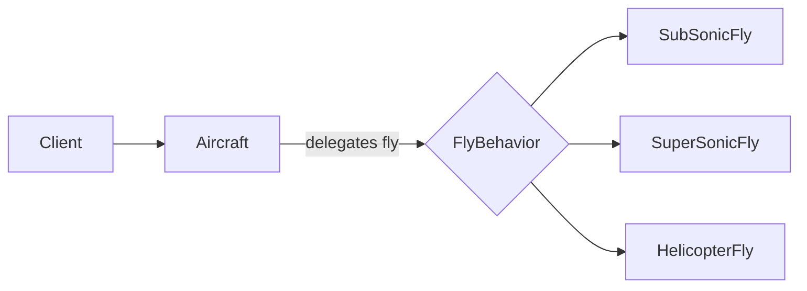

#### 4. UML 类图

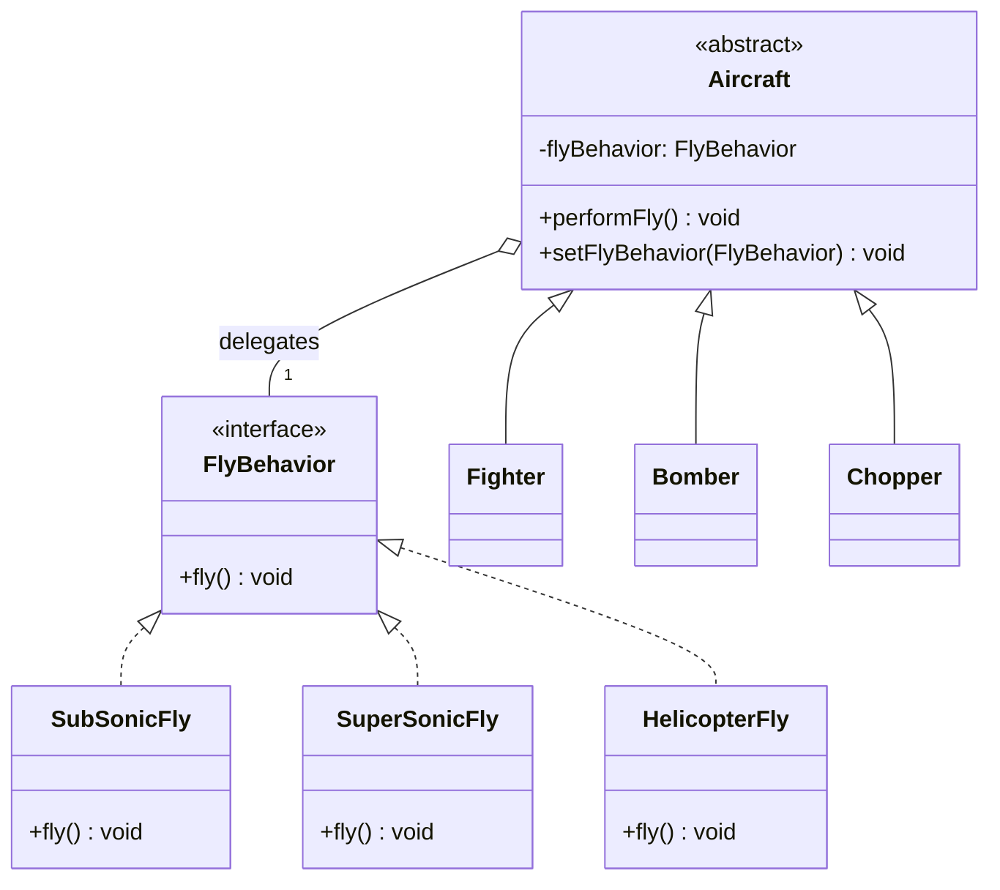

说明：策略可独立存在并在运行时替换，因此 `Aircraft` 与 `FlyBehavior` 使用聚合/关联，而不是继承。

#### 5. 关键代码

```java
public interface FlyBehavior {
    void fly();
}

public final class SuperSonicFly implements FlyBehavior {
    @Override
    public void fly() {
        System.out.println("fly at supersonic speed");
    }
}

public abstract class Aircraft {
    private FlyBehavior flyBehavior;

    protected Aircraft(FlyBehavior flyBehavior) {
        this.flyBehavior = flyBehavior;
    }

    public void performFly() {
        flyBehavior.fly();
    }

    public void setFlyBehavior(FlyBehavior flyBehavior) {
        this.flyBehavior = flyBehavior;
    }
}
```

#### 6. 原则、优缺点和场景

- **OCP/DIP**：新增飞行策略不改 `Aircraft`；`Aircraft` 依赖策略接口。
- **SRP/CRP**：飞机与飞行算法职责分离；以组合获得变化行为。
- 优点：替代条件分支，策略可独立测试和运行时替换。
- 缺点：类数量增加，客户端需要了解策略差异。
- 适用：存在多种可互换算法且算法经常变化。

> **关联资料**：[课件-策略模式](../../课件/02策略模式.pdf)；[pmx-策略模式](../../旧课件/pmx/02策略模式.pdf)

---

## 设计题2：策略模式 - 买票系统打折

**【2019】** 一个买票系统中，不同角色有不同打折方案。用策略模式设计，画图并说明适用场景。

> 出处：[押题汇总#p1](../往年题/2015、2017、2018、2019押题、2019.pdf#page=1)

### 参考答案（模板 4.4）

#### 1. 模式与意图

使用 **Strategy**，把折扣算法从售票上下文中分离并允许运行时选择。

#### 2. 角色映射

| 角色 | 对应元素 |
|---|---|
| Context | `TicketContext` |
| Strategy | `DiscountStrategy` |
| ConcreteStrategy | `StudentDiscount`、`MilitaryDiscount`、`VipDiscount` |
| Client | 根据乘客身份选择策略的售票程序 |

#### 3. UML 类图

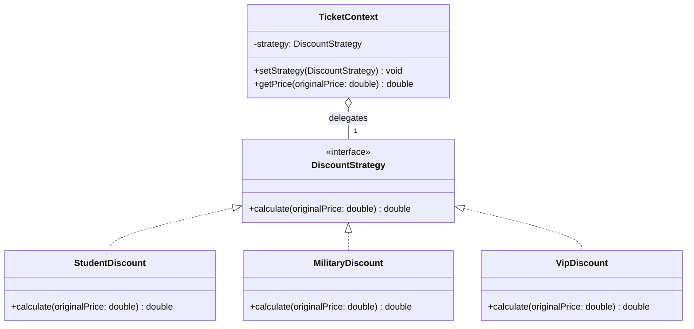

#### 4. 关键代码

```java
public interface DiscountStrategy {
    double calculate(double originalPrice);
}

public final class StudentDiscount implements DiscountStrategy {
    @Override
    public double calculate(double originalPrice) {
        return originalPrice * 0.5; // 五折，不是“0.5折”
    }
}

public final class TicketContext {
    private DiscountStrategy strategy;

    public void setStrategy(DiscountStrategy strategy) {
        this.strategy = strategy;
    }

    public double getPrice(double originalPrice) {
        return strategy.calculate(originalPrice);
    }
}
```

#### 5. 原则、优缺点和场景

- **OCP/DIP/SRP/CRP**：新增折扣类不改上下文；上下文依赖接口；算法职责独立；使用组合。
- 优点：消除复杂 `if-else`，算法可独立测试和切换。
- 缺点：客户端负责选择策略，策略类数量增加。
- 适用：折扣、排序、压缩、路由等多种算法可互换的场景。

> **关联资料**：[课件-策略模式](../../课件/02策略模式.pdf)

---

## 设计题3：Adapter + Observer - 游戏角色通知

**【2019】** 人类角色持有武器并通过 `fight()` 攻击；巨魔也持有武器，但攻击方法为 `beat()`。要求巨魔能和人类角色一起游戏，并在角色死亡时通知其他存活角色。

> 出处：[Exam0-往年考试.pdf#p11](../往年题/Exam0-往年考试.pdf#page=11)

### 参考答案（模板 4.5）

#### 1. 变化点与模式分工

- `fight()` 与 `beat()` 接口不兼容：使用 **Adapter**。
- 一个角色死亡后通知多个存活角色：使用 **Observer**。
- 题目只说角色“持有武器”，没有要求运行时更换攻击算法，因此 **Strategy 不是必需模式**；若追加“武器可动态切换”，再将武器建模为 Strategy。

#### 2. 组合理由

Adapter 解决结构兼容，Observer 解决一对多状态同步。两者处理的是独立子问题，不能互相替代。

#### 3. 角色映射

| 模式 | 角色 | 对应元素 |
|---|---|---|
| Adapter | Target | `GameCharacter` |
| Adapter | Adaptee | `Troll` |
| Adapter | Adapter | `TrollAdapter` |
| Observer | Subject | `GameSession` |
| Observer | Observer | `GameCharacter` |
| Observer | ConcreteObserver | `Knight`、`Cavalry`、`Infantry`、`TrollAdapter` |

#### 4. UML 类图

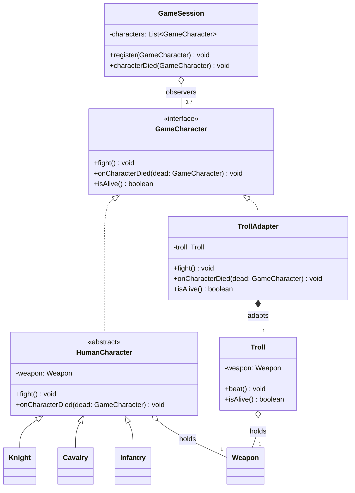

#### 5. 关键代码

```java
public interface GameCharacter {
    void fight();
    void onCharacterDied(GameCharacter dead);
    boolean isAlive();
}

public final class TrollAdapter implements GameCharacter {
    private final Troll troll;

    public TrollAdapter(Troll troll) {
        this.troll = troll;
    }

    public void fight() {
        troll.beat();
    }

    public boolean isAlive() {
        return troll.isAlive();
    }

    public void onCharacterDied(GameCharacter dead) {
        // 更新该角色的游戏状态
    }
}

public final class GameSession {
    private final List<GameCharacter> characters = new ArrayList<>();

    public void characterDied(GameCharacter dead) {
        for (GameCharacter character : characters) {
            if (character != dead && character.isAlive()) {
                character.onCharacterDied(dead);
            }
        }
    }
}
```

#### 6. 原则与取舍

- **OCP/DIP**：增加新角色适配器或观察者时，`GameSession` 仍依赖 `GameCharacter` 抽象。
- **SRP**：接口适配与死亡通知分别由 Adapter 和 Subject 负责。
- 代价：需要管理观察者注册、注销和通知顺序。

> **关联资料**：[pmx-观察者模式](../../旧课件/pmx/06观察者与行为型模式.pdf)；[pmx-适配器](../../旧课件/pmx/07适配器与组合.pdf)

---

## 设计题4：Composite - OA/大学通知系统

**【2021】【2022】** 大学/公司由若干部门组成，人员属于某个部门，形成树状结构。管理员可以选择整个部门或某些个人接收通知。

> 出处：[2021痛苦回忆#p1](../往年题/2021%20痛苦回忆.pdf#page=1)、[2022试卷#p2](../往年题/软统2022试卷.pdf#page=2)

### 参考答案（模板 4.4）

#### 1. 模式与意图

使用 **Composite**。把部门（组合节点）与个人（叶子节点）抽象为统一的 `OrganizationUnit`，管理员可用同一操作向单人或整棵部门子树发送通知。

> 原题强调“树状结构”和“选择部门或个人”，没有订阅/状态变化语义，因此 Observer 不是主答案。若系统进一步要求人员动态订阅公告主题，才增加 Observer。

#### 2. 角色映射

| Composite 角色 | 对应元素 |
|---|---|
| Component | `OrganizationUnit` |
| Composite | `Department` |
| Leaf | `Person` |
| Client | `Administrator/OAService` |

#### 3. UML 类图

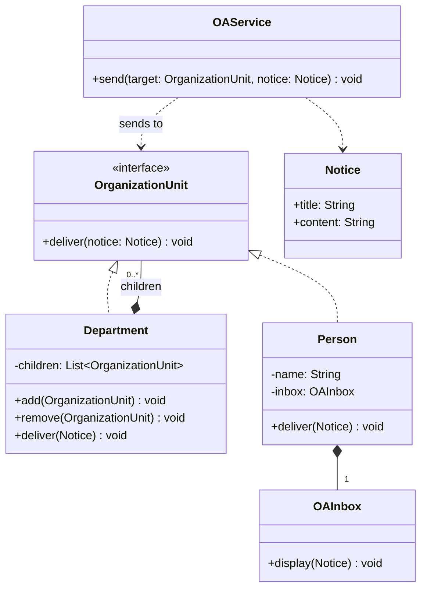

#### 4. 关键代码

```java
public interface OrganizationUnit {
    void deliver(Notice notice);
}

public final class Department implements OrganizationUnit {
    private final List<OrganizationUnit> children = new ArrayList<>();

    public void add(OrganizationUnit child) {
        children.add(child);
    }

    public void deliver(Notice notice) {
        children.forEach(child -> child.deliver(notice));
    }
}

public final class Person implements OrganizationUnit {
    private final OAInbox inbox;

    public Person(OAInbox inbox) {
        this.inbox = inbox;
    }

    public void deliver(Notice notice) {
        inbox.display(notice);
    }
}
```

#### 5. 原则、优缺点和场景

- **OCP/DIP/CRP**：客户端依赖统一 Component；可增加新叶子/组合类型；部门组合子节点。
- 优点：整体和部分统一处理，递归传播自然。
- 缺点：难以限制某些节点类型；超大组织树需要考虑重复人员、权限和性能。
- 适用：组织机构、文件系统、菜单、图形对象等部分-整体树。

> **关联资料**：[pmx-组合模式](../../旧课件/pmx/07适配器与组合.pdf)

---

## 设计题5：Command + Composite - 组合命令

**【2021】** 什么是组合命令（宏命令）？写出组合命令类的大致代码。

> 出处：[2021痛苦回忆#p1](../往年题/2021%20痛苦回忆.pdf#page=1)

### 参考答案（模板 4.5）

#### 1. 变化点与模式分工

- 请求需要对象化、排队和撤销：**Command**。
- 多个命令需要像单个命令一样统一执行：**Composite**。

#### 2. 组合理由

`MacroCommand` 与叶子命令实现同一 `Command` 接口，并组合多个子命令，因此 Invoker 无需区分单命令和宏命令。

#### 3. UML 类图

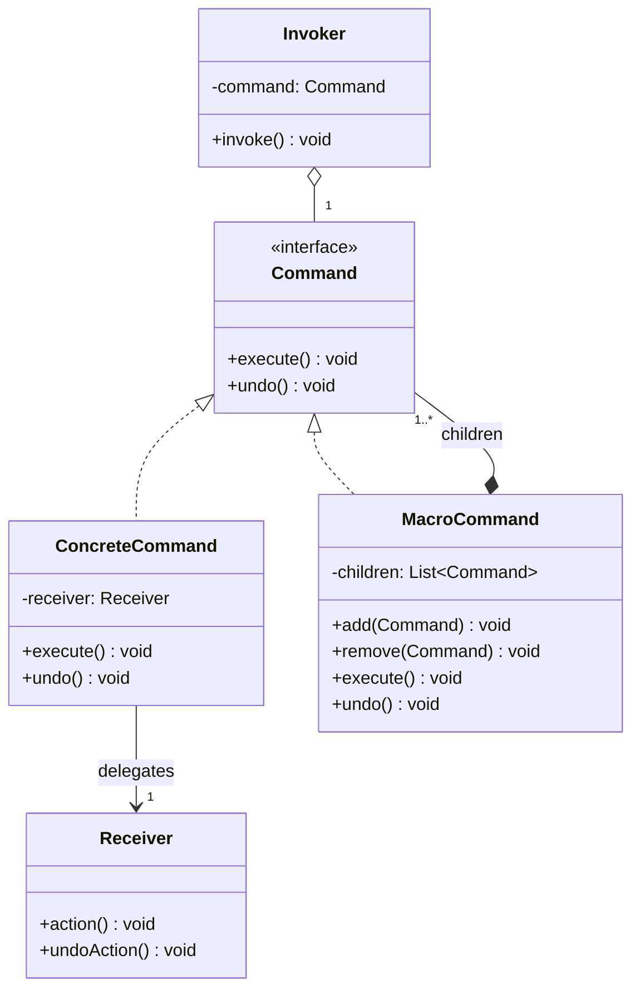

#### 4. 关键代码

```java
public final class MacroCommand implements Command {
    private final List<Command> commands = new ArrayList<>();

    public void add(Command command) {
        commands.add(command);
    }

    public void remove(Command command) {
        commands.remove(command);
    }

    public void execute() {
        commands.forEach(Command::execute);
    }

    public void undo() {
        for (int i = commands.size() - 1; i >= 0; i--) {
            commands.get(i).undo();
        }
    }
}
```

#### 5. 原则与取舍

- **OCP/DIP/CRP**：Invoker 和宏命令只依赖 `Command`；通过组合构建复杂命令。
- 撤销必须逆序；还要处理部分命令执行失败后的补偿/回滚。

> **关联资料**：[pmx-状态命令模式](../../旧课件/pmx/05状态与命令模式.pdf)

---

## 设计题6：Pipe-and-Filter - 文本处理

**【2021】** 输入文本文件，输出排序后的无重复单词列表。要求画组件-连接器图、组件类图、实现代码，并说明映射。

> 出处：[2021痛苦回忆#p1](../往年题/2021%20痛苦回忆.pdf#page=1)

### 参考答案（参照模板 4.4）

#### 1. 模式与意图

使用 **Pipe-and-Filter**。每个 Filter 完成一个独立转换，Pipe 传递数据，形成可组合流水线。

#### 2. C&C 架构图

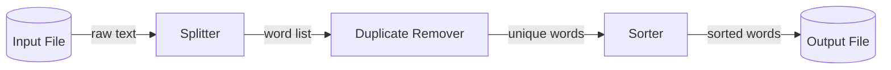

方框是 Filter，带类型标注的箭头是 Pipe，文件节点是 Source/Sink。

#### 3. UML 类图

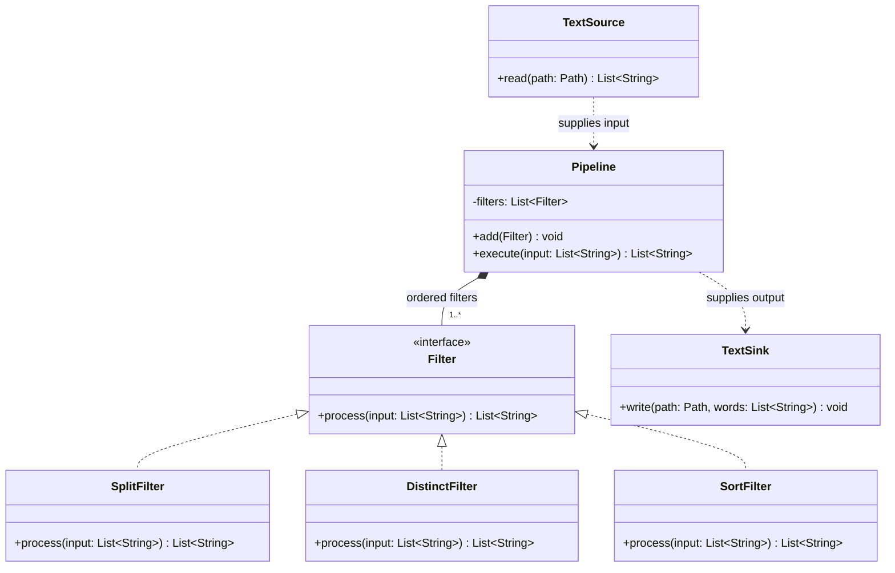

#### 4. 关键代码

```java
public interface Filter {
    List<String> process(List<String> input);
}

public final class SplitFilter implements Filter {
    public List<String> process(List<String> input) {
        return Arrays.stream(input.get(0).split("\\s+"))
                .filter(word -> !word.isBlank())
                .toList();
    }
}

public final class DistinctFilter implements Filter {
    public List<String> process(List<String> input) {
        return new ArrayList<>(new LinkedHashSet<>(input));
    }
}

public final class SortFilter implements Filter {
    public List<String> process(List<String> input) {
        return input.stream().sorted().toList();
    }
}

public final class Pipeline {
    private final List<Filter> filters = new ArrayList<>();

    public void add(Filter filter) {
        filters.add(filter);
    }

    public List<String> execute(List<String> input) {
        List<String> result = input;
        for (Filter filter : filters) {
            result = filter.process(result);
        }
        return result;
    }
}

public final class TextSource {
    public List<String> read(Path path) throws IOException {
        return List.of(Files.readString(path));
    }
}

public final class TextSink {
    public void write(Path path, List<String> words) throws IOException {
        Files.write(path, words);
    }
}
```

#### 5. 图与代码映射

- `SplitFilter`、`DistinctFilter`、`SortFilter` 对应 C&C 图中的三个 Filter。
- `Pipeline.execute()` 中的中间 `List<String>` 对应 Pipe 中传递的数据。
- `TextSource/TextSink` 对应 Source/Sink。

#### 6. 原则与取舍

- **SRP/OCP/DIP/CRP**：每个 Filter 单一职责；Pipeline 依赖 Filter 接口并组合步骤。
- 优点：步骤可独立测试、复用和替换。
- 缺点：数据格式转换有开销，不适合强交互或大量共享状态。

> **关联资料**：[旧课件-架构模式](../../旧课件/2025_UG_SysArch4_patterns.pdf)；[笔记-系统架构#p34](../笔记/软件系统设计-系统架构.pdf#page=34)

---

## 设计题7：Observer + Connector/Adapter - 分布式缓存同步

**【2015】【2019】【2022】** N 台服务器各有缓存。更新某缓存后必须提交数据库，并使其他缓存失效后重新加载；异构服务器使用不同协议和接口。

> 出处：[2015真题第3页](../往年题/2015/3.jpg)、[2022试卷#p2](../往年题/软统2022试卷.pdf#page=2)、[Exam0-往年考试.pdf#p12](../往年题/Exam0-往年考试.pdf#page=12)

### 参考答案（模板 4.5，按 2022 原题分问）

#### (a) 新增组件

新增 `CacheCoordinator`：

1. 接收某缓存已经更新并提交数据库的事件。
2. 保存其他缓存节点/连接器的注册信息。
3. 通知除源缓存外的缓存失效并从数据库重新加载。

#### (b) Observer 角色映射

| Observer 角色 | 系统元素 |
|---|---|
| Subject | `CacheCoordinator` |
| ConcreteSubject | 集群中的协调器实例 |
| Observer | `CacheObserver`/统一缓存连接器接口 |
| ConcreteObserver | 各缓存节点；异构场景下为各协议 Adapter |

#### UML 类图

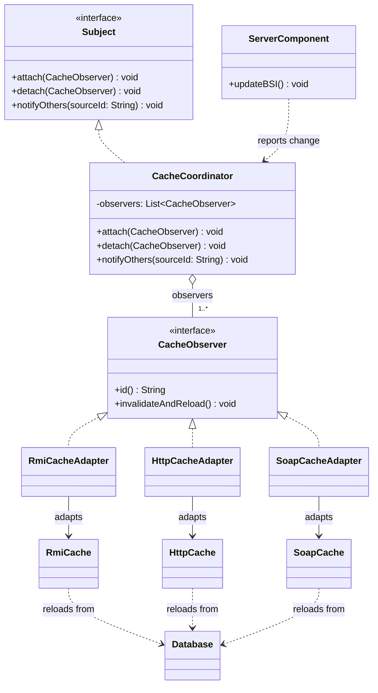

#### (c) 序列图

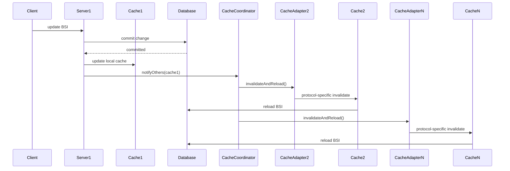

#### (d) 异构调用方式

选择 **Connector/Adapter**：定义统一的 `CacheObserver` 接口，为 RMI、HTTP/JSP、SOAP 分别实现 Adapter。协调器只调用 `invalidateAndReload()`，协议转换由 Adapter 完成。

也可选择 Web Service：为缓存统一暴露 REST/SOAP 契约；但回答时应明确协议、接口和错误处理如何统一，不能只写“使用 Web Service”。

#### 原则与风险

- **DIP/OCP/SRP**：协调器依赖统一接口；新增协议只增加 Adapter；协调与协议转换职责分离。
- 风险：中央协调器单点、同步广播延迟、通知失败、重复通知。
- 改进：协调器冗余、异步消息、重试、幂等、版本号和最终一致性。

> **关联资料**：[pmx-观察者模式](../../旧课件/pmx/06观察者与行为型模式.pdf)；[旧课件-架构模式](../../旧课件/2025_UG_SysArch4_patterns.pdf)

---

## 设计题8：Multi-instance 模式

**【2022】** 设计 Multi-instance 模式，保证某类对象数量不超过常量 n，并写实现代码。

> 出处：[2022试卷#p2](../往年题/软统2022试卷.pdf#page=2)

### 参考答案（模板 4.4）

#### 1. 模式与意图

使用 **Multi-instance/Multiton**。私有化构造方法并由类集中管理最多 n 个实例；达到上限后复用已有实例。

#### 2. UML 类图

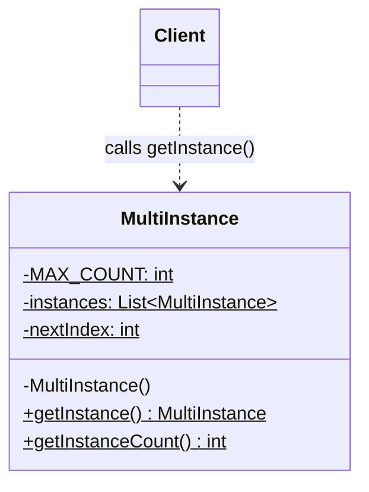

`$` 表示静态成员，构造方法为私有。

#### 3. 关键代码

```java
public final class MultiInstance {
    private static final int MAX_COUNT = 3;
    private static final List<MultiInstance> INSTANCES = new ArrayList<>();
    private static int nextIndex;

    private MultiInstance() {}

    public static synchronized MultiInstance getInstance() {
        if (INSTANCES.size() < MAX_COUNT) {
            MultiInstance created = new MultiInstance();
            INSTANCES.add(created);
            return created;
        }
        MultiInstance result = INSTANCES.get(nextIndex);
        nextIndex = (nextIndex + 1) % MAX_COUNT;
        return result;
    }

    public static synchronized int getInstanceCount() {
        return INSTANCES.size();
    }
}
```

#### 4. 正确性与取舍

- 私有构造保证客户端不能绕过数量限制。
- `synchronized` 保证并发创建时不超过 n。
- 达到 n 后轮询复用实例，不会继续创建。
- 优点：控制稀缺资源数量。
- 缺点：全局状态、生命周期和测试隔离较困难；静态访问并不天然符合 DIP。

> **关联资料**：[课件-创建型模式](../../课件/04创建型模式.pdf)；[pmx-创建型模式](../../旧课件/pmx/04创建型模式.pdf)

---

## 设计题9：Factory Method + Composite + Strategy - 多渠道通知

**【2025】** 通过多个通知渠道通知利益相关者；不同渠道只有满足运行时条件时才能使用；系统应避免生成用不到的信息。

> 出处：[2025期末](../往年题/软统25期末-不完全准确.jpeg)

### 参考答案（模板 4.5）

#### 1. 变化点与模式分工

| 变化点 | 模式 | 作用 |
|---|---|---|
| 消息何时、如何创建 | **Factory Method** | 条件通过后才创建渠道专用消息，避免无用对象 |
| 单一渠道与渠道组统一处理 | **Composite** | 一次调用可通知一个渠道或多个渠道 |
| 渠道运行时可用条件变化 | **Strategy** | 把网络、用户偏好、时间窗口等条件封装为策略 |

> 题目没有明确“订阅者随 Subject 状态变化自动同步”，所以 Observer 不是必需模式；若渠道需要动态订阅事件源，可再增加 Observer。

#### 2. 组合理由

Factory Method 解决创建，Composite 解决结构，Strategy 解决运行时行为。条件检查必须发生在消息创建之前，才能真正满足“避免生成用不到的信息”。

#### 3. UML 类图

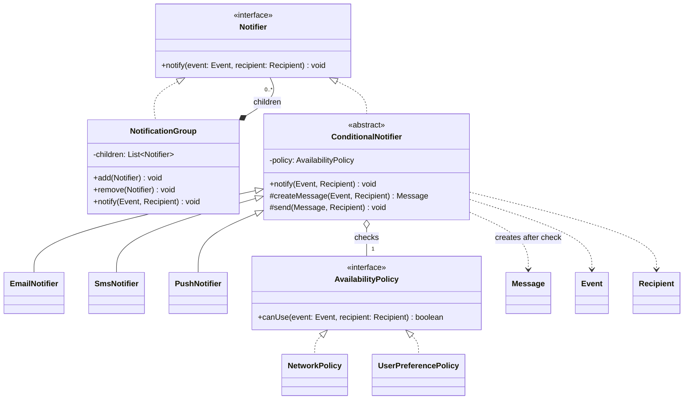

`ConditionalNotifier.createMessage()` 是 Factory Method；`NotificationGroup` 是 Composite；`AvailabilityPolicy` 是 Strategy。

#### 4. 关键代码

```java
public abstract class ConditionalNotifier implements Notifier {
    private final AvailabilityPolicy policy;

    protected ConditionalNotifier(AvailabilityPolicy policy) {
        this.policy = policy;
    }

    @Override
    public final void notify(Event event, Recipient recipient) {
        if (!policy.canUse(event, recipient)) {
            return;
        }
        Message message = createMessage(event, recipient); // 条件通过后才创建
        send(message, recipient);
    }

    protected abstract Message createMessage(Event event, Recipient recipient);
    protected abstract void send(Message message, Recipient recipient);
}

public final class NotificationGroup implements Notifier {
    private final List<Notifier> children = new ArrayList<>();

    public void notify(Event event, Recipient recipient) {
        children.forEach(child -> child.notify(event, recipient));
    }
}
```

#### 5. 原则与取舍

- **OCP/DIP/SRP/CRP**：可增加渠道、组合和条件策略；高层依赖抽象；创建、条件和发送分离。
- 优点：渠道可组合，条件可替换，消息按需创建。
- 缺点：类与配置关系增多；需要处理重试、去重、优先级和部分渠道失败。

> **关联资料**：[课件-工厂模式](../../课件/03工厂模式.pdf)；[课件-策略模式](../../课件/02策略模式.pdf)；[pmx-组合模式](../../旧课件/pmx/07适配器与组合.pdf)

---

## 设计题10：外卖平台微服务设计

**【2025】** 外卖平台为什么适合微服务？说明微服务拆分及其具体应用。

> 出处：[2025期末](../往年题/软统25期末-不完全准确.jpeg)

### 参考答案（架构题，参照模板 4.5）

#### 1. 为什么适合微服务

- 用户、商家、订单、支付、配送、通知是边界较清晰的业务能力。
- 各模块流量和可靠性要求不同，需要独立扩缩和故障隔离。
- 多团队可独立开发、测试和部署服务。

#### 2. 按业务能力拆分

| 操作 | 微服务 | 主要职责 |
|---|---|---|
| 注册、登录 | User Service | 用户资料与认证 |
| 浏览餐厅、菜单 | Merchant Service | 商家与菜品 |
| 下单、查单 | Order Service | 订单生命周期 |
| 支付、退款 | Payment Service | 支付渠道与退款 |
| 配送调度 | Delivery Service | 骑手与配送任务 |
| 消息推送 | Notification Service | SMS、Push、站内信 |

不要按“Controller/Service/DAO”等技术层拆成服务，否则业务修改仍会跨多个服务。

#### 3. 核心架构模式

- **API Gateway**：统一入口、认证、路由、限流。
- **Service Registry/Discovery**：服务注册与动态发现。
- **Circuit Breaker**：依赖服务故障时快速失败，避免级联故障。
- 可选扩展：Database per Service、事件驱动和 Saga，用于数据自治与跨服务流程。

#### 4. C&C 架构图

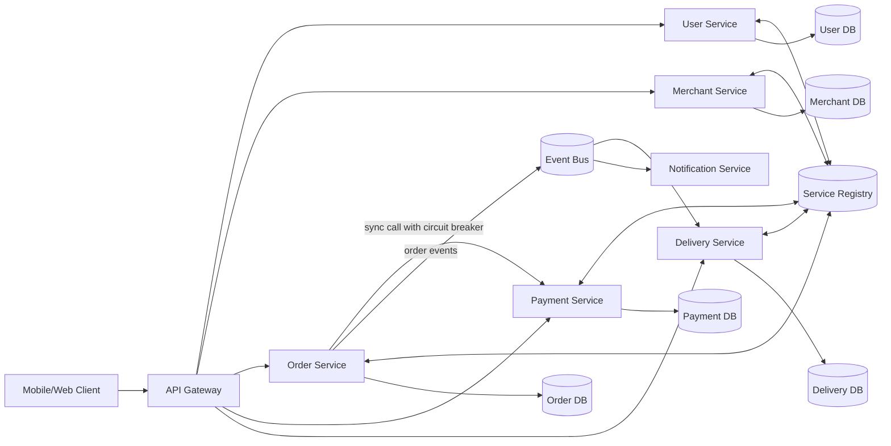

#### 5. 操作与服务映射示例

```text
用户提交订单 -> API Gateway -> Order Service
Order Service 创建订单 -> 调用 Payment Service 或发布支付事件
支付成功 -> 发布事件 -> Delivery Service 创建配送任务
Notification Service 消费事件 -> 通知用户
```

#### 6. 质量属性与取舍

- **可修改性/可部署性**：服务可独立演进和部署。
- **可伸缩性**：浏览、订单、支付可按负载独立扩容。
- **可用性**：熔断、限流、降级、健康检查和冗余实例。
- **代价**：网络开销、数据一致性、链路追踪、部署监控和测试复杂度上升。

> **关联资料**：[旧课件-微服务#p3](<../../旧课件/Lecture 03 - Microservices Patterns.pdf#page=3>)；[笔记-系统架构#p65](../笔记/软件系统设计-系统架构.pdf#page=65)
