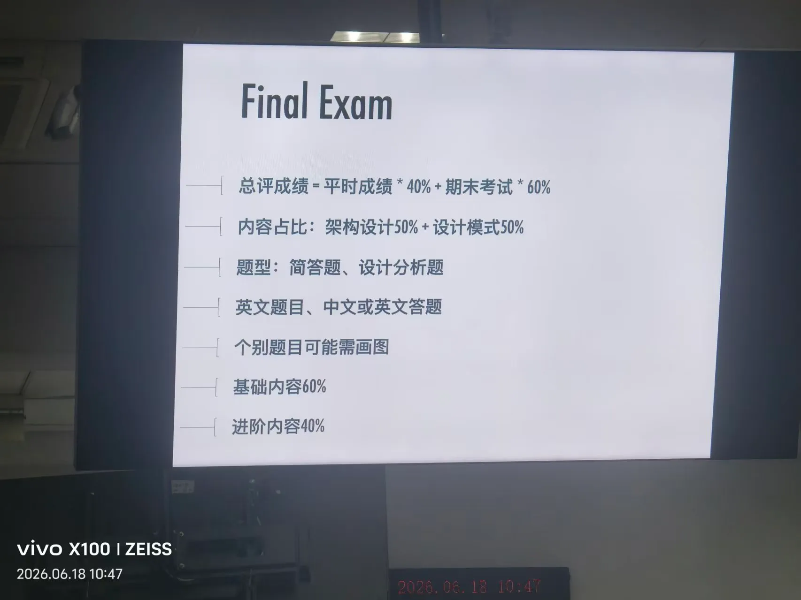
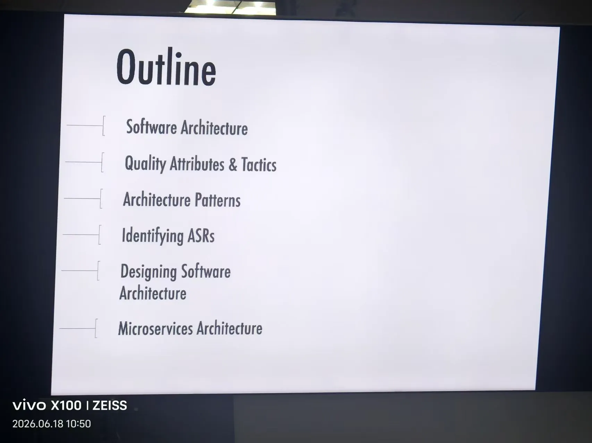
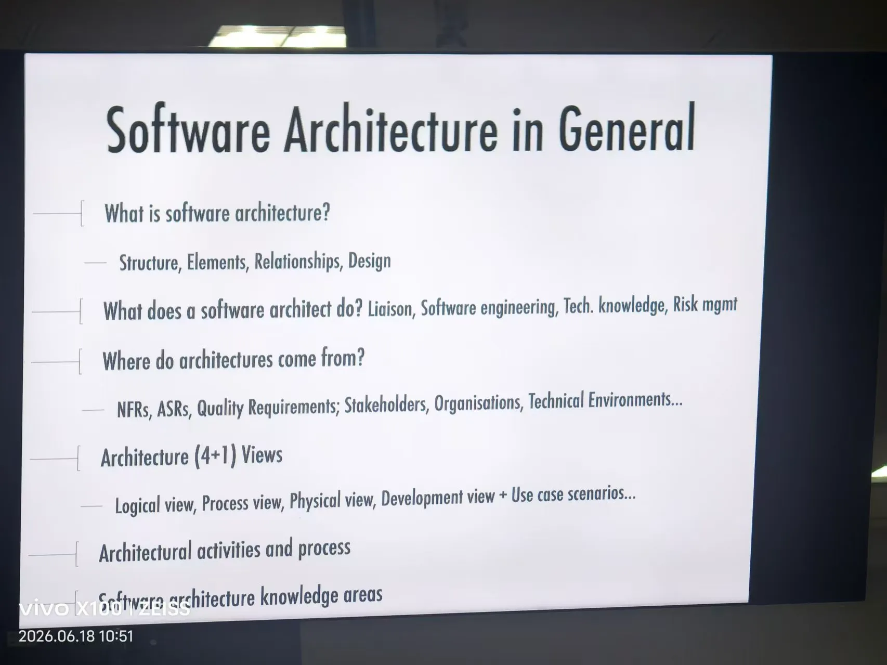
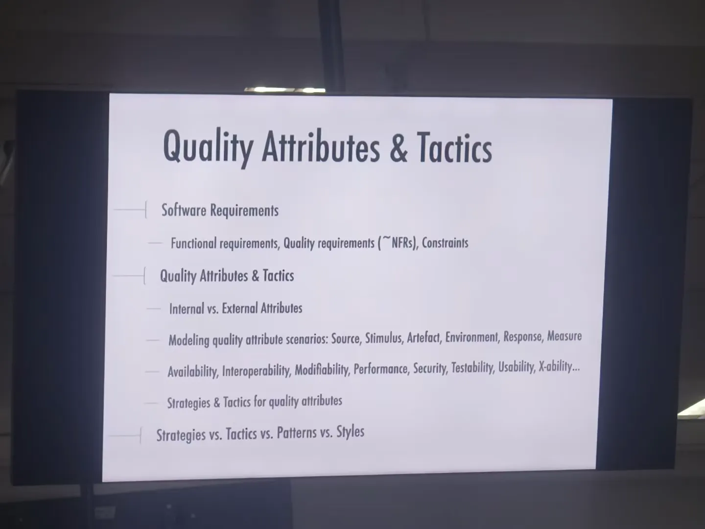
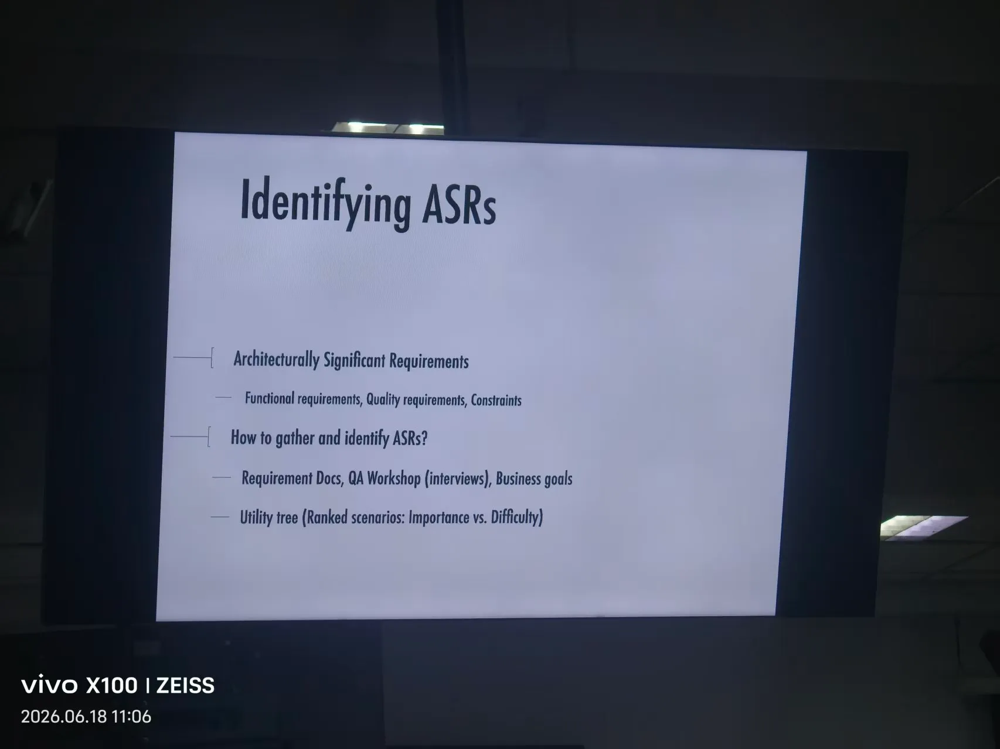
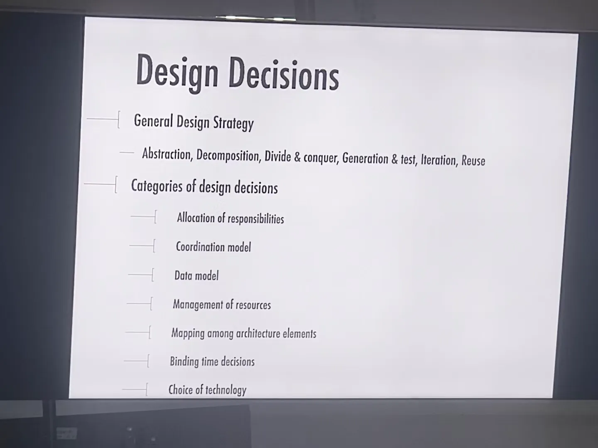
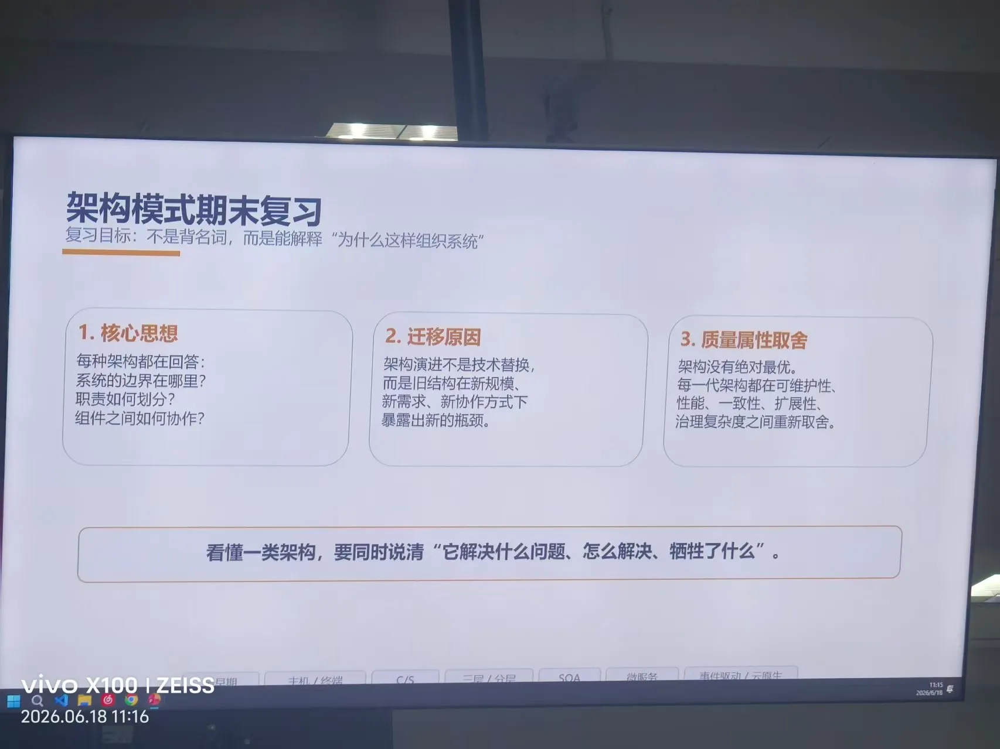
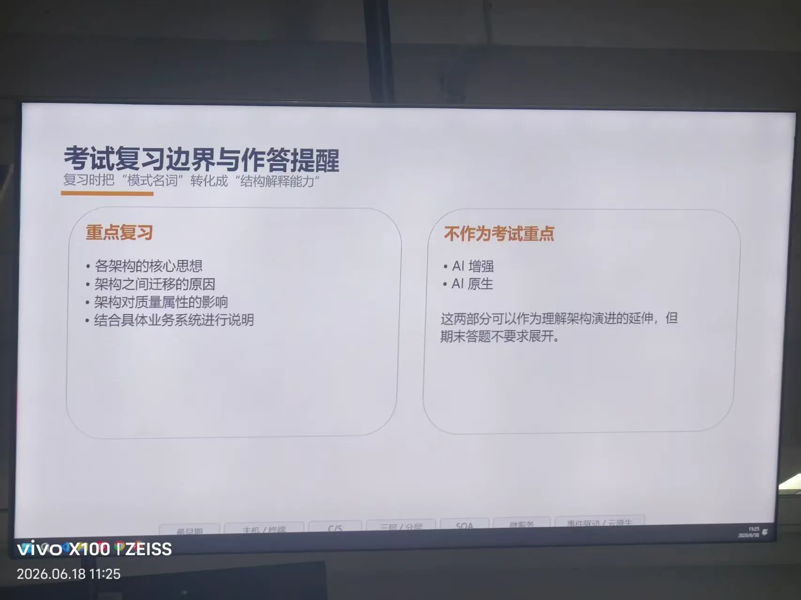

## 0. 图片记录解析

### 0.1 考试形式与范围

来源图片：

- 总评成绩 = 平时成绩 40% + 期末考试 60%。
- 期末考试内容比例：架构设计 50% + 设计模式 50%。
- 题型：简答题、设计分析题。
- 题目可能为英文，答案可以用中文或英文。
- 个别题目可能要求画图，例如 4+1 视图、质量属性刺激-响应图、设计模式类图、C&C 视图、微服务拆分图。
- 基础内容约 60%，进阶内容约 40%。
- 题目可能给一个业务场景要求完成设计，也可能给一个已有设计要求分析问题、指出质量属性取舍、提出改进。

### 0.2 架构部分课堂复习目录

来源图片：

架构设计部分重点包括：

1. Software Architecture
2. Quality Attributes & Tactics
3. Architecture Patterns
4. Identifying ASRs
5. Designing Software Architecture
6. Microservices Architecture

### 0.3 Software Architecture in General

来源图片：

需要掌握：

- What is software architecture?
  - 关键词：Structure, Elements, Relationships, Design。
- What does a software architect do?
  - 关键词：Liaison, Software engineering, Technical knowledge, Risk management。
- Where do architectures come from?
  - 关键词：NFRs, ASRs, Quality Requirements, Stakeholders, Organisations, Technical Environments。
- Architecture (4+1) Views
  - Logical view, Process view, Physical view, Development view + Use case scenarios。
- Architectural activities and process。
- Software architecture knowledge areas。

### 0.4 Quality Attributes & Tactics

来源图片：

需要掌握：

- Software Requirements = Functional requirements + Quality requirements/NFRs + Constraints。
- Internal attributes vs External attributes。
- 质量属性场景建模六要素：
  - Source, Stimulus, Artifact, Environment, Response, Response Measure。
- 重点质量属性：
  - Availability, Interoperability, Modifiability, Performance, Security, Testability, Usability, X-ability。
- 质量属性的 Strategies & Tactics。
- 区分 Strategies vs Tactics vs Patterns vs Styles。

### 0.5 Identifying ASRs

来源图片：

需要掌握：

- ASR = Architecturally Significant Requirement，架构攸关需求。
- ASR 可以来自：
  - Functional requirements
  - Quality requirements
  - Constraints
- 如何收集和识别 ASR：
  - Requirement Docs
  - QA Workshop / QAW / Interviews
  - Business goals
  - Utility Tree
- Utility Tree 的排序维度：
  - Importance vs Difficulty

### 0.6 Design Decisions

来源图片：

通用设计策略：

- Abstraction
- Decomposition
- Divide & conquer
- Generation & test
- Iteration
- Reuse

设计决策类别：

1. Allocation of responsibilities
2. Coordination model
3. Data model
4. Management of resources
5. Mapping among architecture elements
6. Binding time decisions
7. Choice of technology

### 0.7 架构模式期末复习边界

来源图片：、

复习目标：

- 不是背架构名词，而是能解释“为什么这样组织系统”。
- 看懂一类架构时，要同时说清：
  - 它解决什么问题。
  - 它怎么解决。
  - 牺牲了什么。

重点复习：

- 各架构的核心思想。
- 架构之间迁移的原因。
- 架构对质量属性的影响。
- 结合具体业务系统进行说明。

不作为考试重点：

- AI 增强。
- AI 原生。

---

---

[返回总导航](../考试重点.md)

