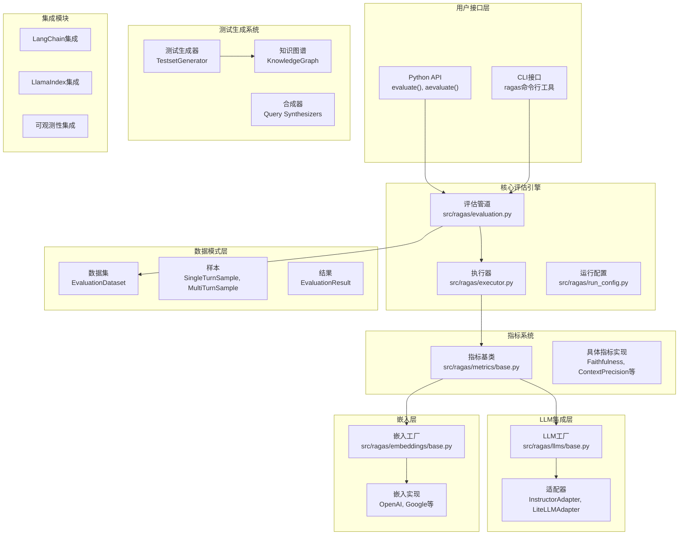

# Ragas项目软件架构图及组件详解

## 软件架构图

## 各包和类详细作用表

| 包/模块 | 类/函数 | 作用 | 关键方法 |
|---------|---------|------|----------|
| **ragas.evaluation** | `evaluate()` | 主要评估入口点 | 接受数据集和指标，返回评估结果 [1](#1-0)  |
| | `aevaluate()` | 异步评估入口点 | 异步版本的evaluate函数 [2](#1-1)  |
| **ragas.metrics.base** | `Metric` | 指标基类 | 定义指标接口和通用方法 |
| | `MetricWithLLM` | 需要LLM的指标基类 | 为需要语言模型的指标提供LLM支持 |
| | `SingleTurnMetric` | 单轮评估指标 | 处理单次问答交互的评估 |
| | `MultiTurnMetric` | 多轮评估指标 | 处理多轮对话的评估 |
| **ragas.llms.base** | `llm_factory()` | LLM工厂函数 | 统一创建不同提供商的LLM实例 [3](#1-2)  |
| | `InstructorLLM` | Instructor LLM包装器 | 使用instructor库实现结构化输出 |
| | `LiteLLMStructuredLLM` | LiteLLM包装器 | 支持多种LLM提供商的统一接口 |
| **ragas.embeddings.base** | `embedding_factory()` | 嵌入工厂函数 | 创建嵌入模型实例 |
| | `BaseRagasEmbedding` | 嵌入基类 | 定义嵌入接口和通用方法 [4](#1-3)  |
| **ragas.dataset_schema** | `EvaluationDataset` | 评估数据集 | 存储和管理评估数据 |
| | `SingleTurnSample` | 单轮样本 | 表示单次问答交互的数据结构 |
| | `MultiTurnSample` | 多轮样本 | 表示多轮对话的数据结构 |
| | `EvaluationResult` | 评估结果 | 存储评估结果和相关信息 |
| **ragas.executor** | `Executor` | 执行引擎 | 管理并行执行和任务调度 |
| **ragas.testset** | `TestsetGenerator` | 测试集生成器 | 从文档生成测试数据集 |
| | `KnowledgeGraph` | 知识图谱 | 用于测试数据生成的知识表示 |
| **ragas.prompt** | `BasePrompt` | 提示基类 | 定义提示模板和生成逻辑 [5](#1-4)  |
| | `PydanticPrompt` | Pydantic提示 | 使用Pydantic模型的类型安全提示 |
| **ragas.integrations** | `LangchainLLMWrapper` | LangChain包装器 | 兼容LangChain的LLM接口 |
| | `LlamaIndexLLMWrapper` | LlamaIndex包装器 | 兼容LlamaIndex的LLM接口 |
| **ragas.experimental** | `Experiment` | 实验管理 | 新的实验框架 [6](#1-5)  |
| | `experiment` | 实验装饰器 | 用于定义和运行实验 |
